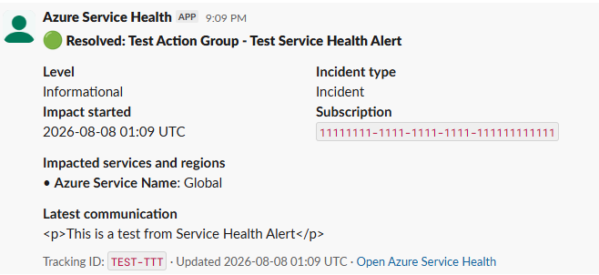

# Azure Service Health Slack Bot

A standalone, production-oriented Flask service that receives Azure Service
Health alerts through Azure Monitor's Common Alert Schema and posts them to
Slack. Service Health alerts create one root message per subscription and
tracking ID. Later lifecycle changes update that canonical message and add a
short broadcast reply to its thread. The root shows the current state, while
the replies preserve each subsequent Updated or Resolved transition.

This repository intentionally has **no** Slack Bolt app, no inbound Slack
events, and no Azure support-ticket workflow. It only initializes a Slack
`WebClient` for outbound messages.

## Contents

- [Start here](#start-here)
- [Architecture](#architecture)
- [Routes](#routes)
- [Prerequisites](#prerequisites)
- [Local development](#local-development)
- [Service Health routing](#service-health-routing)
- [Idempotency and lifecycle](#idempotency-and-lifecycle)
- [Security](#security)
- [Production decisions and trade-offs](#production-decisions-and-trade-offs)
- [Deploy with AZD](#deploy-with-azd)
- [Step-by-step deployment guide](#step-by-step-deployment-guide)
- [Day-2 alert scope management](#day-2-alert-scope-management)
- [Operations](#operations)
- [Tests](#tests)
- [Community and support](#community-and-support)

## Start here

This repository is a reference implementation for teams that want Azure Service
Health incidents in Slack without treating Slack as the source of truth. Choose
the path that matches what you need to evaluate:

| Goal | Start with |
|---|---|
| Understand the event path and trust boundaries | [Architecture](#architecture), [Security](#security), and [Production decisions and trade-offs](#production-decisions-and-trade-offs) |
| Run the parser and application locally | [Local development](#local-development) and [Service Health routing](#service-health-routing) |
| Deploy the first subscription safely | [Step-by-step deployment guide](#step-by-step-deployment-guide) |
| Expand beyond one subscription | [Day-2 alert scope management](#day-2-alert-scope-management) |
| Monitor or troubleshoot the integration | [Operations](#operations) and [Troubleshooting](#troubleshooting) |

## Architecture

The production deployment uses Azure Container Apps, Azure Table Storage,
Key Vault, a user-assigned managed identity, Azure Container Registry, and
workspace-based Application Insights. Azure Monitor sends Activity Log Alerts
with Common Alert Schema to `POST /api/service-health` through a Secure
Webhook Action Group. Container Apps Easy Auth validates the Entra token and
the application also requires the official AzNS caller application and the
`ActionGroupsSecureWebhook` app role.

Key Vault and the Storage account are provisioned with public network access
disabled and are reachable only through Private Endpoints on a dedicated
VNet (also used for the Container Apps environment's VNet integration); this
keeps the deployment compliant with tenants/policies that require
`publicNetworkAccess: Disabled` on these resource types. The Container App's
public ingress (health probes and the secure webhook) is unaffected.


*Operator map: numbered blue arrows are the business event path; orange is
container delivery, green is private network/data access, dashed purple is
RBAC/control, and dotted gray is telemetry. Azure service symbols use the
official [Microsoft Azure Architecture Icons](https://learn.microsoft.com/azure/architecture/icons/)
from the [V24 SVG pack](https://arch-center.azureedge.net/icons/Azure_Public_Service_Icons_V24.zip)
under Microsoft's [published icon terms](https://learn.microsoft.com/azure/architecture/icons/#icon-terms).
The embedded product artwork is unmodified (not cropped, flipped, rotated,
distorted, or recolored), and each icon has its Azure product name nearby.*

### Example Slack incident message

The first valid notification creates one root message. Each accepted lifecycle
change updates that canonical message and adds a short broadcast reply to its
thread. Identical retries and stale notifications do not call Slack.



*Static canonical message using test identifiers. The root always shows the
latest state; its thread retains the broadcast update timeline described in
[Idempotency and lifecycle](#idempotency-and-lifecycle).*

### Why these resources exist

The Azure portal shows both workload resources and Azure-generated supporting
resources. This table explains how each visible resource relates to the
operator map instead of treating the resource group as a flat inventory.

| Resource type | Location | Purpose and relationship |
|---|---|---|
| Azure Container Registry (ACR) | East US 2 | Receives the Docker image built by `azd`, then supplies that image to each Container App revision. The managed identity receives only `AcrPull`; registry admin access remains disabled. |
| Action Group | Global | Converts the matched alert into an Entra-authenticated Secure Webhook request using Common Alert Schema. Its receiver targets the Container App's public HTTPS endpoint. |
| Activity Log Alert | Global | Matches `ServiceHealth` events at subscription or management-group scope and invokes the Action Group. Service Health alerts require Global location. |
| Application Insights | East US 2 | Collects OpenTelemetry requests, dependencies, exceptions, and custom metrics from the application. It is workspace-based and feeds the supporting Failure Anomalies alert. |
| Container App | East US 2 | Hosts public health probes and the Easy Auth protected webhook. The application performs authorization, parsing, routing, Table-backed idempotency, canonical Slack updates, and broadcast thread replies. |
| Container Apps Environment | East US 2 | Provides the VNet-integrated compute boundary and sends platform logs to Log Analytics. The application runs as a revision inside this environment. |
| Failure Anomalies | Global (Azure-generated) | Supporting Application Insights smart-detection alert created automatically by Azure. It monitors failure-rate anomalies but is not part of the Service Health-to-Slack business flow. |
| User-assigned Managed Identity | East US 2 | Authenticates the running revision to ACR, Key Vault, and Table Storage without application credentials. Its roles are exactly `AcrPull`, `Key Vault Secrets User`, and `Storage Table Data Contributor`. |
| Key Vault | East US 2 | Stores the Slack `xoxb-` token. Public network access is disabled; the Container App resolves and reaches it through the Key Vault Private DNS zone and private endpoint. |
| Log Analytics workspace | East US 2 | Stores Container Apps platform/application logs and backs workspace-based Application Insights for KQL queries and retention. |
| Key Vault Private Endpoint | East US 2 | Gives Key Vault a private IP in the private-endpoint subnet and is the Container App's private data path to the Slack token. |
| Table Storage Private Endpoint | East US 2 | Gives the Storage Table service a private IP in the private-endpoint subnet and carries incident-state, lease, and deduplication traffic. |
| Network interfaces (2, Azure-generated) | East US 2 | Azure creates one NIC implementation detail for each private endpoint. They appear in the portal resource list but are intentionally summarized inside the two private-endpoint nodes rather than cluttering the main flow. |
| Key Vault Private DNS zone | Global | `privatelink.vaultcore.azure.net`; linked to the VNet so the public Key Vault hostname resolves to the Key Vault private endpoint. |
| Table Storage Private DNS zone | Global | `privatelink.table.core.windows.net`; linked to the VNet so the Table endpoint resolves to the Storage private endpoint. |
| Storage account and Table | East US 2 | Persists incident lifecycle state, root and latest thread-reply timestamps, ETags, and leases for deduplication. HTTPS/TLS 1.2 is enforced, shared-key access is disabled, and data flows through the private endpoint. |
| Virtual network | East US 2 | Contains the delegated Container Apps infrastructure subnet and the private-endpoint subnet, keeping Key Vault and Table egress private while leaving the authenticated webhook ingress public. |

## Routes

| Route | Purpose |
|---|---|
| `POST /api/service-health` | Authenticated Common Alert Schema webhook |
| `GET /healthz` | Process liveness (public) |
| `GET /readyz` | Service Health configuration readiness (public) |

The webhook consumes Azure Monitor's
[Common Alert Schema](https://learn.microsoft.com/azure/azure-monitor/alerts/alerts-common-schema):
standard fields are under `data.essentials`, and alert-specific fields are
under `data.alertContext`. For Service Health, the app confirms
`eventSource: ServiceHealth` and reads `subscriptionId`, Active/Resolved
`status`, and `Properties.title`, `Properties.communication`,
`Properties.trackingId`, and `Properties.impactedServices`. The last field is
itself escaped JSON containing `ServiceName` and `RegionName`, as documented in
[Service Health notification properties](https://learn.microsoft.com/azure/service-health/service-health-notifications-properties).

## Prerequisites

- Python 3.13 for local development and the cross-platform operational CLIs
- Current stable [Azure CLI](https://learn.microsoft.com/cli/azure/install-azure-cli),
  [Azure Developer CLI (`azd`)](https://learn.microsoft.com/azure/developer/azure-developer-cli/install-azd),
  and Docker with a Linux container engine
- A Slack app with an [`xoxb-` bot token](https://docs.slack.dev/authentication/tokens/#bot)
  limited to the granular [`chat:write` scope](https://docs.slack.dev/reference/scopes/chat.write)
  and invited to every configured destination channel
- An Azure subscription where you can create the resources in `infra/`
- `Application Administrator` (or equivalent Graph permission) while running
  the Secure Webhook setup script

## Local development

1. Copy `.env-example` to `.env`.
2. Set `SLACK_BOT_TOKEN`, a Table endpoint accessible through
   `DefaultAzureCredential`, and a routing file or inline routing JSON.
3. Install and run:

```sh
pip install -r requirements.txt
python app.py
```

Build the production image with `docker build -t azure-service-health-slack-bot .`.
The builder falls back to Microsoft's Python package proxy when direct PyPI
downloads are blocked by a corporate network. Override `PIP_INDEX_URL` or
`PIP_FALLBACK_INDEX_URL` with Docker build arguments when required.

## Service Health routing

Set either `SERVICE_HEALTH_ROUTES_JSON` or `SERVICE_HEALTH_ROUTES_FILE`. See
`config/service_health_routes.example.json`. `default_channel_id` is required
as a fallback. Rules may filter by `subscription_ids`, `services`, and
`regions`. All supplied filters on a rule must match; highest priority wins,
then greatest specificity, then file order. The first selected channel is
stored with the incident and remains fixed for that incident's lifecycle.

## Idempotency and lifecycle

The incident key is the normalized subscription ID (`PartitionKey`) plus a
SHA-256 hash of the tracking ID (`RowKey`). Azure Table ETags and a short
processing lease coordinate concurrent replicas. Identical retries and stale
updates (an older `submissionTimestamp` than what's stored) return `200`
without calling Slack. Transient Slack or Storage failures return `503` so
Azure Monitor can retry; invalid payloads and permanent Slack errors (for
example an unknown channel) return `4xx` and are not retried.

The first accepted event calls `chat.postMessage` to create the root. Every
newer accepted event calls `chat.update` so that root remains the canonical
current state, then calls `chat.postMessage` with the root's `thread_ts` and
`reply_broadcast: true`. The concise reply makes the change visible in the
channel and records a chronological thread timeline. This requires only the
existing `chat:write` scope; the bot still receives no Slack events.

Each lease has a unique owner token, and the processor verifies that ownership
whenever it must read back an ETag. Before each Slack write, it conditionally
renews the Table lease.
After `chat.update` succeeds, it checkpoints the new root fingerprint and
submission watermark before attempting the thread reply, then renews the lease
for that second call. If the reply fails transiently, the same delivery resumes
at the reply-only step instead of updating the root again; an older delivery is
still rejected against the checkpointed watermark. Slack requests use a
10-second timeout so one request plus the SDK's bounded connection retry stays
inside the renewed 30-second lease.

## Security

- **Easy Auth (Entra ID)**: validates the caller's Microsoft Entra token.
  Container Apps documents that the configured client ID is always an allowed
  audience and that the default App ID URI is
  `api://<APPLICATION_CLIENT_ID>`; see
  [Microsoft Entra authentication for Container Apps](https://learn.microsoft.com/azure/container-apps/authentication-entra).
- **App-level check**: the app additionally requires the official AzNS AAD
  Webhook application ID (`461e8683-5575-4561-ac7f-899cc907d62a`), the
  `ActionGroupsSecureWebhook` app role, and the configured audience —
  see `service_health/auth.py`. Entra v2 tokens identify the audience with the
  API client ID; both that GUID and its `api://<client-id>` identifier URI are
  accepted explicitly.
- **Managed Identity**: the Container App uses a user-assigned managed
  identity with exactly three roles: **AcrPull** (registry), **Key Vault
  Secrets User** (Slack bot token), and **Storage Table Data Contributor**
  (incident state). No Reader or Support Request Contributor roles are
  granted.
- **Public probes**: `/healthz` and `/readyz` remain publicly reachable
  (Easy Auth `unauthenticatedClientAction: AllowAnonymous`); only
  `/api/service-health` enforces the app-role check.
- **No secret logging**: request/response bodies and Slack/Azure credentials
  are never logged.

## Production decisions and trade-offs

The deployment favors predictable incident delivery and policy-compliant data
access over the smallest possible resource footprint. Review these choices
before using the pattern in production:

| Decision | Current choice | Operational implication |
|---|---|---|
| Container readiness | The Container App runs with `minReplicas: 1` and scales to at most three replicas. | One ready replica avoids adding a cold start to incident delivery, but creates baseline compute cost. Test Azure Monitor retry behavior before considering scale-to-zero. |
| Webhook boundary | Public Container Apps ingress protected by Easy Auth plus AzNS caller, app-role, and audience checks. | Azure Monitor can reach the endpoint without exposing Key Vault or Storage. An unauthenticated webhook returning `200` is a security regression. |
| Secret and state access | Key Vault and Table Storage use private endpoints, private DNS, and disabled public network access. | The data path stays private, with added private endpoint cost and DNS ownership. |
| Source of truth | Azure Service Health remains authoritative; Slack is the coordination surface. | The bot keeps one canonical message and a broadcast thread timeline, but does not acknowledge incidents, page responders, create tickets, or replace an incident management platform. |
| Entra provisioning | The preprovision hook configures the API app, AzNS ownership, and `ActionGroupsSecureWebhook` role. | Initial setup requires Application Administrator or equivalent permission. Treat that as a governed deployment prerequisite, not an application runtime role. |
| Retry contract | Duplicate and stale deliveries return `200`; transient Slack or Storage failures return `503`; invalid payloads and permanent Slack errors return `4xx`. | Azure Monitor retries only failures that may recover, while duplicate notifications do not update the root or create thread replies. |

## Deploy with AZD

No deployment is performed automatically by this repository. Configure an AZD
environment before provisioning. The full, security-safe WSL procedure is in
the [step-by-step deployment guide](#step-by-step-deployment-guide). In
particular, do not paste the Slack token directly into a command:

```bash
az login
azd auth login
azd env new
read -rsp "Slack bot token (input hidden): " SLACK_BOT_TOKEN; printf '\n'
azd env set SLACK_BOT_TOKEN "$SLACK_BOT_TOKEN"
unset SLACK_BOT_TOKEN
```

> **Why base64?** `azd`'s parameter substitution does a raw text replace of
> `${VAR}` into `infra/main.parameters.json` *before* parsing it as JSON, so a
> raw JSON value containing quotes can corrupt the parameter file. Passing the
> routing config as base64 avoids the problem entirely — Bicep decodes it
> (`base64ToString(...)`) before writing it to the container's
> `SERVICE_HEALTH_ROUTES_JSON` environment variable.

The pre-provision hook runs `scripts/configure_secure_webhook.py`. It creates
or reuses the protected API app registration, app role, API service
principal, AzNS ownership, and AzNS app-role assignment, then writes the
resulting IDs to the AZD environment. Azure Monitor requires both ownership of
the protected API app by the AzNS service principal and the
`ActionGroupsSecureWebhook` role assignment. The script is idempotent (safe to
re-run) and requires Microsoft Graph application administration permission.
Azure CLI and AZD maintain separate authentication sessions, so both
`az login` and `azd auth login` are required on a clean workstation.
The platform-neutral hook path follows the official
[AZD Python hook contract](https://learn.microsoft.com/azure/developer/azure-developer-cli/hooks-multi-language#python-hooks):
AZD detects the runtime from the `.py` extension and runs the same script on
Windows, Linux, and macOS.

`infra/modules/service-health-alert.bicep` is deliberately isolated so
`scripts/manage_alert_scopes.py` can create only the Activity Log Alerts and
Action Groups needed by additional subscriptions or a logical Management
Group scope. The
Container App, image, networking, Storage, Key Vault, ACR, and Application
Insights remain central and are not part of day-2 scope operations.

Secrets are copied from AZD environment parameters into Key Vault during
provisioning and exposed to the Container App only as Key Vault secret
references. Runtime access to Key Vault and Table Storage uses the
user-assigned managed identity and RBAC — never shared keys.

The registry defaults to the `Basic` SKU and intentionally has no untagged
manifest retention policy. Azure Container Registry retention is a
[preview, Premium-only feature](https://learn.microsoft.com/azure/container-registry/container-registry-retention-policy);
configuring it on `Basic` causes provisioning to fail.

## Day-2 alert scope management

No prior Log Analytics or Azure Monitor Logs setup is required for any of
this — Service Health events flow through the platform **Activity Log**,
which is enabled by default on every Azure subscription at no cost. This
means the bot works out of the box for any Azure customer, even one with a
brand-new subscription and no monitoring configured.

Run the initial `azd up` once per Microsoft Entra tenant. It creates the central
runtime and an alert for the deployment subscription. After that, use the
cross-platform Python day-2 command; do **not** rerun `azd up` just to add or
remove coverage:

```sh
python scripts/manage_alert_scopes.py list
python scripts/manage_alert_scopes.py add-subscription \
  --subscription-id "00000000-0000-0000-0000-000000000000"
python scripts/manage_alert_scopes.py add-management-group \
  --management-group-id "platform"
python scripts/manage_alert_scopes.py migrate-to-management-group \
  --management-group-id "platform" --what-if
python scripts/manage_alert_scopes.py migrate-to-management-group \
  --management-group-id "platform"
```

Use `--environment-name <azd-environment-name>` when the signed-in tenant has
more than one deployment. `list` reports the tenant, effective coverage,
enabled state, Activity Log Alert and Action Group resource IDs, and any
individual subscription alert overlapped by a Management Group alert.

The command discovers the central resource group, environment, tenant,
Container App webhook, and Secure Webhook client/object/identifier values from
Azure resources and tags. It does not use an AZD environment, local cached
secrets, or the original deployment machine, and it never reads or prints the
Slack token. The initial AZD-owned baseline alert and its anchor Action Group
remain immutable: day-2 discovery requires
`service-health-managed-by=manage-alert-scopes`, excludes the baseline resources,
and rejects any new scope that would overlap their coverage.

| Command | Behavior |
|---|---|
| `list` | Read-only inventory and overlap/effective coverage analysis. |
| `add-subscription --subscription-id <id>` | Creates a dedicated peripheral resource group containing only the scope's Action Group and initially disabled Activity Log Alert, runs Azure Monitor's official signed `servicehealth` test, then enables the alert. Repeating the command is safe. |
| `add-management-group --management-group-id <id>` | Enumerates the Management Group's accessible descendants and adds one subscription-scoped alert path per descendant, managed as one logical scope. It proceeds only when no enabled individual or Management Group scope overlaps it. |
| `remove-subscription --subscription-id <id>` | Removes an individual alert only when an enabled Management Group alert is proven to cover the subscription. |
| `remove-management-group --management-group-id <id>` | Removes all member alert paths for a logical Management Group scope only when every accessible descendant subscription has proven replacement coverage. |
| `migrate-to-management-group --management-group-id <id>` | Creates and tests every descendant subscription path while disabled, asks for explicit confirmation, then hands off each overlapping subscription without leaving two active paths. It rechecks the replacement alert and Action Group before deleting the disabled original and restores the original if the replacement becomes inactive. |

Add operations support `--what-if`. Remove and migration operations support
`--what-if`, require an explicit confirmation, and accept `--force` only for
non-interactive automation where that approval has already happened. The
manager fails closed if tenant membership, Management Group descendants,
existing coverage, permissions, or Secure Webhook test success cannot be
proven. It rejects cross-tenant subscriptions and Management Groups. Use
`--json` for machine-readable output.

Manager-tagged Action Groups left behind by an interrupted delete remain
discoverable in `list` as cleanup-required state; a later repair or confirmed
remove can reconcile them without relying on local files or the original
workstation.

The operator needs **Contributor** on every target descendant subscription
where a dedicated alert resource group is created, plus read access to the
target Management Group and all managed subscriptions so membership and
overlap detection are complete. Permission checks run before mutation and
report the missing Azure operations.

Azure Activity Log Alerts cannot natively target one selected Management Group:
`tenantScope` represents the whole tenant and cannot be combined with
subscription scopes. The manager therefore implements a Management Group as a
logical scope that fans out to one alert per descendant subscription. The
legacy `managementGroupId` initial-deployment parameter is retained only for
configuration compatibility and must be empty; configure Management Group
coverage with the day-2 command after the central deployment.

## Step-by-step deployment guide

This is the complete, from-zero WSL walkthrough: create the Slack app, safely
capture its token, provision Azure, wire up the Secure Webhook, and verify an
end-to-end alert. Unless noted otherwise, run commands from an Ubuntu WSL
terminal in the repository root.

### 0. Prerequisites

- Azure subscription with permission to create resource groups and role
  assignments (`Owner` or `Contributor` + `User Access Administrator`) at the
  target subscription.
- A Microsoft Entra role that can create app registrations and app roles for
  the Secure Webhook app (`Application Administrator` or `Cloud Application
  Administrator`, or an admin who can grant consent once).
- [Azure CLI](https://learn.microsoft.com/cli/azure/install-azure-cli),
  [Azure Developer CLI (`azd`)](https://learn.microsoft.com/azure/developer/azure-developer-cli/install-azd),
  Git, and Python 3 installed inside WSL.
- Docker Desktop using the WSL 2 backend, Linux containers, and WSL integration
  enabled for the distribution where you run this guide. Docker recommends
  WSL 2.1.5 or later.
- A Slack workspace where you can create/install apps. You don't need a new
  workspace for every test — reuse any workspace where you have permission to
  create apps (e.g. your team's), or create a free one for testing at
  <https://slack.com/get-started#/createnew> in about a minute (no credit
  card, no company approval needed).

The official Linux installer for `azd` is:

```bash
curl -fsSL https://aka.ms/install-azd.sh | bash
```

Use current stable tool releases. This deployment was revalidated with Azure
CLI 2.84.0, Docker 29.6.2, and the WSL 2 backend. `azd` 1.24.1 completed the
deployment, but 1.30.0 was current at the time of the audit and is preferred.
Verify the local toolchain and Docker engine before continuing:

```bash
az version
azd version
python3 --version
docker context show
docker info --format 'engine={{.ServerVersion}} os={{.OSType}}'
docker run --rm hello-world
```

The Docker `os` must be `linux`. On Windows, the Docker Desktop context is
normally `desktop-linux`; inside an integrated WSL distribution it may appear
as `default`. If the daemon is unavailable or reports Windows containers,
start Docker Desktop, select **Use the WSL 2 based engine**, enable the
distribution under **Settings → Resources → WSL Integration**, switch to Linux
containers, and reopen WSL. Do not install a second Docker Engine inside the
distribution when using Docker Desktop.

### 1. Create the Slack app and bot token

1. Go to <https://api.slack.com/apps> and click **Create New App** → **From
   scratch**. Give it a name (e.g. `Azure Service Health`) and pick your
   workspace.
2. Open **OAuth & Permissions** in the left sidebar. Under **Scopes → Bot
   Token Scopes**, add only `chat:write`. Do not add the broader
   `chat:write.public` scope; preserve least privilege by explicitly inviting
   the bot to each destination channel.
3. Click **Install to Workspace** at the top of the same page, review the
   permissions, and approve.
4. Leave the **Bot User OAuth Token** (starts with `xoxb-`) in the Slack UI
   until step 4. Treat the token as a secret: do not paste it into chat, source
   files, screenshots, logs, or a literal shell command.
5. Invite the bot to every channel it needs to post in, e.g.
   `/invite @Azure Service Health` in each destination channel — the bot
   token alone does not grant channel membership.

This app only ever calls `chat.postMessage` (root and broadcast thread replies)
and `chat.update` (canonical root); it never receives events, so **no Signing
Secret, Event Subscriptions, slash commands, or app manifest are required.**
Its Slack messages include both blocks and a top-level `text` value, which
Slack uses as the notification and screen-reader
[accessibility fallback](https://docs.slack.dev/reference/methods/chat.postMessage/#accessibility-considerations).

### 2. Clone the repo and sign in

```sh
git clone https://github.com/ricmmartins/azure-service-health-slack-bot.git
cd azure-service-health-slack-bot
az login
azd auth login
az account show --query '{tenant:tenantId,subscription:id,name:name}' -o table
azd auth login --check-status
```

`az` and `azd` keep separate credential caches, so both logins are required
even if you're already signed in to one. Both commands use interactive browser
authentication by default. If Conditional Access blocks device-code flow, do
not add `--use-device-code`; use the browser flow from a WSL session that can
open the Windows browser. `azd auth login --use-device-code=false` explicitly
forces browser authentication. A headless Cloud Shell or SSH session that can
only offer device code will not bypass that tenant policy.

### 3. Create the routing configuration

Copy the example and edit it for your subscriptions/services/regions/channels
(Slack channel IDs, not names):

```bash
cp config/service_health_routes.example.json config/service_health_routes.json
```

To discover the ID in Slack, open the destination channel, select the channel
name or the **three dots** menu, choose **View channel details**, and select
**Copy channel ID** at the bottom. Public channel IDs normally start with `C`;
private channel IDs can start with `G`. A copied channel URL also contains the
ID, but do not configure `#channel-name`.

Slack's API-based discovery method is
[`conversations.list`](https://docs.slack.dev/reference/methods/conversations.list),
but it requires additional read scopes. The UI procedure above avoids expanding
this bot's permissions beyond `chat:write`.

`default_channel_id` is mandatory; it's where anything that doesn't match a
rule is posted. See [Service Health routing](#service-health-routing) above
for the matching rules. Confirm that the bot is a member of every configured
channel.

### 4. Initialize the AZD environment

```bash
# Prompts for an environment name, subscription, and Azure region.
azd env new

# Paste only at the hidden prompt. The token never appears on screen or in
# shell history; the command history contains only the variable name.
read -rsp "Slack bot token (input hidden): " SLACK_BOT_TOKEN; printf '\n'
while [[ "$SLACK_BOT_TOKEN" != xoxb-* ]]; do
  unset SLACK_BOT_TOKEN
  echo "Expected an xoxb token; try again." >&2
  read -rsp "Slack bot token (input hidden): " SLACK_BOT_TOKEN; printf '\n'
done
azd env set SLACK_BOT_TOKEN "$SLACK_BOT_TOKEN"
unset SLACK_BOT_TOKEN

ROUTES_B64="$(base64 -w0 config/service_health_routes.json)"
azd env set SERVICE_HEALTH_ROUTES_JSON_B64 "$ROUTES_B64"
unset ROUTES_B64
```

> `SERVICE_HEALTH_ROUTES_JSON_B64` must be base64-encoded (see the note in
> [Deploy with AZD](#deploy-with-azd) for why). Bicep decodes it before it
> reaches the container as the plain-JSON `SERVICE_HEALTH_ROUTES_JSON`
> environment variable — the application itself never sees base64.

`azd env set` persists the token in the selected local AZD environment so it
can be passed as a secure Bicep parameter into Key Vault. AZD environment
`.env` files are ignored by this repository's `*.env` rule, but they still
contain a credential: protect the workstation, never commit or print them, and
do not use `azd env get-values` in logs because it prints every value. Rotate
the Slack token immediately if it is ever exposed.

`AZURE_ENV_NAME`, `AZURE_LOCATION`, and `AZURE_SUBSCRIPTION_ID` are captured
by `azd env new`; every other required Bicep parameter is filled in
automatically by the provisioning steps below.

### 5. Provision Azure infrastructure

Register the providers that were absent in the live test subscription, then
provision:

```bash
az provider register --namespace Microsoft.App --wait
az provider register --namespace Microsoft.ContainerService --wait
azd provision
```

This runs `scripts/configure_secure_webhook.py` as a `preprovision` hook
before touching any Azure resource. The script:

1. Creates (or reuses) an Entra app registration that represents the
   protected webhook API and sets its `identifierUri` to `api://<app-id>`.
2. Adds an app role named `ActionGroupsSecureWebhook` (application-only) if
   it doesn't already exist.
3. Ensures a service principal exists for that app, and for Microsoft's
   official **AzNS AAD Webhook** application
   (`461e8683-5575-4561-ac7f-899cc907d62a`).
4. Adds the AzNS service principal as an owner of the protected API app, as
   required by Azure Monitor to create, modify, and test Secure Webhook actions.
5. Grants the AzNS service principal the `ActionGroupsSecureWebhook` app
   role on your API app — this is what lets Azure Monitor's Secure Webhook
   Action Group call your endpoint with a verifiable Entra token.
6. Writes `AZURE_TENANT_ID`, `SERVICE_HEALTH_API_CLIENT_ID`,
   `SERVICE_HEALTH_API_OBJECT_ID`, and `SERVICE_HEALTH_API_IDENTIFIER_URI`
   into the AZD environment for the Bicep deployment to consume.

These operations follow Azure Monitor's official
[Secure Webhook configuration](https://learn.microsoft.com/azure/azure-monitor/alerts/action-groups#configure-authentication-for-secure-webhook):
the protected API accepts v2 tokens, exposes an application-only app role, and
assigns that role to the fixed AzNS AAD Webhook application. This daemon flow
does not use an interactive redirect URI. The Python hook owns only the Entra
application/service-principal contract; `infra/modules/container-app.bicep`
remains the source of truth for Container Apps Easy Auth issuer, audiences,
allowed AzNS application, HTTPS, and anonymous route handling.

`azd provision` then deploys `infra/main.bicep`, which creates the resource
group, Container Apps environment, Container Registry, Key Vault (with the
Slack bot token as a secret), Storage Account/Table, Application Insights,
the Container App itself (Easy Auth wired to the app registration from the
script), and the Activity Log Alert + Secure Action Group targeting the
current subscription. The Service Health Activity Log Alert and Action Group
are both created in the `Global` location. Service Health notifications require
a Global Action Group; a regional Action Group does not work for this alert
type. Microsoft documents this requirement, the Secure Webhook AzNS ownership
and application-role setup, and retry behavior in
[Create and manage Action Groups](https://learn.microsoft.com/azure/azure-monitor/alerts/action-groups).

The protected API exposes `api://<client-id>`, requests Entra v2 tokens, and
configures Easy Auth to accept both valid audience forms: the client ID GUID
that Entra v2 commonly emits and `api://<client-id>`. The application performs
the same normalization before checking the audience claim.

### 6. Deploy the application image

```sh
azd deploy
```

Builds the Docker image from this repo, pushes it to the new Container
Registry, and updates the Container App revision. `azd up` combines steps 5
and 6 (`azd provision && azd deploy`) if you prefer a single command.

### 7. Verify the deployment

Capture only the nonsecret outputs needed by the checks:

```bash
APP_URI="$(azd env get-value SERVICE_APP_URI)"
RESOURCE_GROUP="$(azd env get-value AZURE_RESOURCE_GROUP)"
APP_NAME="$(azd env get-value SERVICE_APP_NAME)"
ENV_NAME="$(azd env get-value AZURE_ENV_NAME)"
ACTION_GROUP="ag-${ENV_NAME}-service-health"
ACTIVITY_ALERT="ala-${ENV_NAME}-service-health"
API_CLIENT_ID="$(azd env get-value SERVICE_HEALTH_API_CLIENT_ID)"
API_IDENTIFIER_URI="$(azd env get-value SERVICE_HEALTH_API_IDENTIFIER_URI)"
ACR_LOGIN_SERVER="$(azd env get-value AZURE_CONTAINER_REGISTRY_ENDPOINT)"
ACR_NAME="${ACR_LOGIN_SERVER%%.*}"
STORAGE_NAME="$(az storage account list --resource-group "$RESOURCE_GROUP" --query '[0].name' -o tsv)"
KEY_VAULT_NAME="$(az keyvault list --resource-group "$RESOURCE_GROUP" --query '[0].name' -o tsv)"
IDENTITY_ID="$(az containerapp show --resource-group "$RESOURCE_GROUP" --name "$APP_NAME" \
  --query 'keys(identity.userAssignedIdentities)[0]' -o tsv)"
IDENTITY_PRINCIPAL_ID="$(az identity show --ids "$IDENTITY_ID" --query principalId -o tsv)"
```

`SERVICE_APP_URI` already includes `https://`; do not prepend another scheme.

#### 7.1 Health, readiness, and authentication boundary

```bash
test "$(curl -fsS "$APP_URI/healthz")" = '{"status":"healthy"}'
test "$(curl -fsS "$APP_URI/readyz")" = '{"status":"ready"}'

WEBHOOK_RESPONSE="$(mktemp)"
HTTP_CODE="$(curl -sS -o "$WEBHOOK_RESPONSE" -w '%{http_code}' \
  -X POST -H 'Content-Type: application/json' --data '{}' \
  "$APP_URI/api/service-health")"
test "$HTTP_CODE" = "401"
python3 -m json.tool "$WEBHOOK_RESPONSE"
rm -f "$WEBHOOK_RESPONSE"
```

Both probes are intentionally public. `/readyz` returning `200` also proves
the production configuration can initialize with managed identity, Key Vault,
and Table Storage. The unauthenticated webhook must return HTTP `401` with
`authentication_required`; `200` would be a security regression.

#### 7.2 Slack authentication and a visible test post

[`auth.test`](https://docs.slack.dev/reference/methods/auth.test) is Slack's
supported authentication connectivity check. This test reads the `xoxb-` token
at a hidden prompt, sends it only in the HTTP `Authorization` header, and unsets
it immediately after both calls. The literal token is never displayed, written
to disk, or placed in shell history. The test prints only nonsecret Slack IDs
and creates one visible
[`chat.postMessage`](https://docs.slack.dev/reference/methods/chat.postMessage)
post in the configured fallback channel.

```bash
CHANNEL_ID="$(python3 -c \
  'import json; print(json.load(open("config/service_health_routes.json"))["default_channel_id"])')"

read -rsp "Slack bot token (input hidden): " SLACK_BOT_TOKEN; printf '\n'
if [[ "$SLACK_BOT_TOKEN" != xoxb-* ]]; then
  unset SLACK_BOT_TOKEN
  echo "Expected an xoxb bot token." >&2
  exit 1
fi

AUTH_RESPONSE="$(mktemp)"
POST_PAYLOAD="$(mktemp)"
POST_RESPONSE="$(mktemp)"
cleanup_slack_test() {
  unset SLACK_BOT_TOKEN
  rm -f "$AUTH_RESPONSE" "$POST_PAYLOAD" "$POST_RESPONSE"
}
trap cleanup_slack_test EXIT

# Supplying the header through stdin keeps the expanded token out of curl's
# command-line arguments as well as shell history.
slack_api() {
  curl --silent --show-error --fail-with-body \
    --config <(printf 'header = "Authorization: Bearer %s"\n' "$SLACK_BOT_TOKEN") \
    "$@"
}

slack_api https://slack.com/api/auth.test > "$AUTH_RESPONSE"

SLACK_CHANNEL_ID="$CHANNEL_ID" python3 - <<'PY' > "$POST_PAYLOAD"
import json
import os
import sys

json.dump({
    "channel": os.environ["SLACK_CHANNEL_ID"],
    "text": "Azure Service Health deployment validation",
}, sys.stdout)
PY

slack_api \
  -H 'Content-Type: application/json; charset=utf-8' \
  --data-binary "@$POST_PAYLOAD" \
  https://slack.com/api/chat.postMessage > "$POST_RESPONSE"
unset SLACK_BOT_TOKEN

AUTH_RESPONSE="$AUTH_RESPONSE" POST_RESPONSE="$POST_RESPONSE" python3 - <<'PY'
import json
import os

def load_result(method, path):
    with open(path, encoding="utf-8") as response:
        result = json.load(response)
    if not result.get("ok"):
        raise SystemExit(f"{method} failed: {result.get('error', 'unknown_error')}")
    return result

auth = load_result("auth.test", os.environ["AUTH_RESPONSE"])
message = load_result("chat.postMessage", os.environ["POST_RESPONSE"])
print(f"Slack auth OK: team={auth.get('team_id')} bot={auth.get('user_id')}")
print(f"Slack post OK: channel={message.get('channel')} ts={message.get('ts')}")
PY

cleanup_slack_test
trap - EXIT
```

Delete the test message in Slack if it is not needed.

#### 7.3 Azure resources, Secure Webhook, and secret wiring

```bash
(
  set -euo pipefail
  expect() {
    [[ "$1" == "$2" ]] || {
      printf 'Expected %s, got %s\n' "$2" "$1" >&2
      return 1
    }
  }

  expect "$(az containerapp show -g "$RESOURCE_GROUP" -n "$APP_NAME" \
    --query properties.runningStatus -o tsv)" "Running"
  expect "$(az containerapp show -g "$RESOURCE_GROUP" -n "$APP_NAME" \
    --query properties.provisioningState -o tsv)" "Succeeded"
  expect "$(az containerapp show -g "$RESOURCE_GROUP" -n "$APP_NAME" \
    --query properties.template.scale.minReplicas -o tsv)" "1"
  expect "$(az containerapp show -g "$RESOURCE_GROUP" -n "$APP_NAME" \
    --query properties.configuration.ingress.external -o tsv)" "true"
  expect "$(az containerapp show -g "$RESOURCE_GROUP" -n "$APP_NAME" \
    --query properties.configuration.ingress.allowInsecure -o tsv)" "false"

  AUTH_RESOURCE_TYPE="Microsoft.App/containerApps/authConfigs"
  expect "$(az resource show -g "$RESOURCE_GROUP" --resource-type "$AUTH_RESOURCE_TYPE" \
    --name "$APP_NAME/current" --api-version 2024-03-01 \
    --query properties.platform.enabled -o tsv)" "true"
  expect "$(az resource show -g "$RESOURCE_GROUP" --resource-type "$AUTH_RESOURCE_TYPE" \
    --name "$APP_NAME/current" --api-version 2024-03-01 \
    --query 'properties.identityProviders.azureActiveDirectory.validation.defaultAuthorizationPolicy.allowedApplications[0]' \
    -o tsv)" "461e8683-5575-4561-ac7f-899cc907d62a"
  ACTUAL_AUDIENCES="$(az resource show -g "$RESOURCE_GROUP" \
    --resource-type "$AUTH_RESOURCE_TYPE" --name "$APP_NAME/current" \
    --api-version 2024-03-01 \
    --query 'properties.identityProviders.azureActiveDirectory.validation.allowedAudiences' \
    -o tsv | sort)"
  EXPECTED_AUDIENCES="$(printf '%s\n%s\n' "$API_CLIENT_ID" "$API_IDENTIFIER_URI" | sort)"
  expect "$ACTUAL_AUDIENCES" "$EXPECTED_AUDIENCES"

  expect "$(az monitor action-group show -g "$RESOURCE_GROUP" -n "$ACTION_GROUP" \
    --query location -o tsv | tr '[:upper:]' '[:lower:]')" "global"
  expect "$(az monitor action-group show -g "$RESOURCE_GROUP" -n "$ACTION_GROUP" \
    --query enabled -o tsv)" "true"
  expect "$(az monitor action-group show -g "$RESOURCE_GROUP" -n "$ACTION_GROUP" \
    --query 'webhookReceivers[0].useAadAuth' -o tsv)" "true"
  expect "$(az monitor action-group show -g "$RESOURCE_GROUP" -n "$ACTION_GROUP" \
    --query 'webhookReceivers[0].useCommonAlertSchema' -o tsv)" "true"

  expect "$(az monitor activity-log alert show -g "$RESOURCE_GROUP" -n "$ACTIVITY_ALERT" \
    --query location -o tsv | tr '[:upper:]' '[:lower:]')" "global"
  expect "$(az monitor activity-log alert show -g "$RESOURCE_GROUP" -n "$ACTIVITY_ALERT" \
    --query enabled -o tsv)" "true"
  expect "$(az monitor activity-log alert show -g "$RESOURCE_GROUP" -n "$ACTIVITY_ALERT" \
    --query 'condition.allOf[0].equals' -o tsv)" "ServiceHealth"

  expect "$(az acr show --name "$ACR_NAME" --query sku.name -o tsv)" "Basic"
  expect "$(az acr show --name "$ACR_NAME" --query adminUserEnabled -o tsv)" "false"

  expect "$(az storage account show -g "$RESOURCE_GROUP" -n "$STORAGE_NAME" \
    --query enableHttpsTrafficOnly -o tsv)" "true"
  expect "$(az storage account show -g "$RESOURCE_GROUP" -n "$STORAGE_NAME" \
    --query minimumTlsVersion -o tsv)" "TLS1_2"
  expect "$(az storage account show -g "$RESOURCE_GROUP" -n "$STORAGE_NAME" \
    --query allowSharedKeyAccess -o tsv)" "false"
  expect "$(az storage account show -g "$RESOURCE_GROUP" -n "$STORAGE_NAME" \
    --query publicNetworkAccess -o tsv)" "Disabled"
  STORAGE_ID="$(az storage account show -g "$RESOURCE_GROUP" -n "$STORAGE_NAME" \
    --query id -o tsv)"
  TABLE_NAME="$(az rest --method get \
    --url "https://management.azure.com${STORAGE_ID}/tableServices/default/tables/ServiceHealthIncidents?api-version=2023-05-01" \
    --query name -o tsv)"
  [[ "$TABLE_NAME" == "default/ServiceHealthIncidents" ||
     "$TABLE_NAME" == "ServiceHealthIncidents" ]]

  expect "$(az keyvault show -g "$RESOURCE_GROUP" -n "$KEY_VAULT_NAME" \
    --query properties.enableRbacAuthorization -o tsv)" "true"
  expect "$(az keyvault show -g "$RESOURCE_GROUP" -n "$KEY_VAULT_NAME" \
    --query properties.enablePurgeProtection -o tsv)" "true"
  expect "$(az keyvault show -g "$RESOURCE_GROUP" -n "$KEY_VAULT_NAME" \
    --query properties.softDeleteRetentionInDays -o tsv)" "90"
  expect "$(az keyvault show -g "$RESOURCE_GROUP" -n "$KEY_VAULT_NAME" \
    --query properties.publicNetworkAccess -o tsv)" "Disabled"

  ACTUAL_ROLES="$(az role assignment list --assignee-object-id "$IDENTITY_PRINCIPAL_ID" \
    --all --query '[].roleDefinitionName' -o tsv | sort -u)"
  EXPECTED_ROLES="$(printf '%s\n' AcrPull 'Key Vault Secrets User' \
    'Storage Table Data Contributor' | sort)"
  expect "$ACTUAL_ROLES" "$EXPECTED_ROLES"

  SECRET_REFERENCE="$(az containerapp show -g "$RESOURCE_GROUP" -n "$APP_NAME" \
    --query "properties.configuration.secrets[?name=='slack-bot-token'] | [0].keyVaultUrl" \
    -o tsv)"
  [[ "$SECRET_REFERENCE" == \
    "https://${KEY_VAULT_NAME}.vault.azure.net/secrets/slack-bot-token/"* ]]
)
```

These checks use Azure Resource Manager metadata. They confirm that the secret
reference points to a versioned `slack-bot-token` URI, but never request the
secret value. A deployer without Key Vault data-plane access should get an
authorization error if they try to read the value; that is expected and is not
a reason to grant themselves `Key Vault Secrets User`. The Container App's
managed identity is the intended secret reader.

#### 7.4 Official Service Health Action Group test

Use Azure Monitor's signed Service Health test, not a hand-crafted webhook
payload. The CLI command does **not** reuse the receivers stored on the named
Action Group; omitting `--add-action` returns
`BadRequest: There are no valid receivers in the request`. Read the deployed
receiver metadata and pass it back to the
[`test-notifications create` command](https://learn.microsoft.com/cli/azure/monitor/action-group/test-notifications#az-monitor-action-group-test-notifications-create):

```bash
URI="$(az monitor action-group show -g "$RESOURCE_GROUP" -n "$ACTION_GROUP" \
  --query 'webhookReceivers[0].serviceUri' -o tsv)"
OBJECT_ID="$(az monitor action-group show -g "$RESOURCE_GROUP" -n "$ACTION_GROUP" \
  --query 'webhookReceivers[0].objectId' -o tsv)"
IDENTIFIER_URI="$(az monitor action-group show -g "$RESOURCE_GROUP" -n "$ACTION_GROUP" \
  --query 'webhookReceivers[0].identifierUri' -o tsv)"

az monitor action-group test-notifications create \
  --resource-group "$RESOURCE_GROUP" \
  --action-group-name "$ACTION_GROUP" \
  --alert-type servicehealth \
  --add-action webhook slack-service-health "$URI" \
    useaadauth "$OBJECT_ID" "$IDENTIFIER_URI" usecommonalertschema \
  --only-show-errors \
  -o json

az containerapp logs show \
  --resource-group "$RESOURCE_GROUP" \
  --name "$APP_NAME" \
  --type console \
  --tail 200
```

The equivalent portal path is **Monitor → Alerts → Action groups → select the
action group → Test → Service Health**. The
[test-notification REST examples](https://learn.microsoft.com/rest/api/monitor/action-groups/create-notifications-at-action-group-resource-level)
use `Completed` for the operation and receiver, while the isolated Azure
validation for this project returned `Complete` and `Succeeded`. The day-2
manager accepts only those documented or observed exact success values and
fails closed for any other state. A successful result must also produce an HTTP
`200` `POST /api/service-health` from `IcMBroadcaster/1.0` in the Container App
access log and a formatted Service Health message in Slack.

Do not repeatedly run failing tests. Azure Monitor retries retryable webhook
failures up to five times. HTTP `408`, `429`, `503`, and `504`, plus transport
exceptions, are retryable. After the retry sequence is exhausted, Action
Groups suppress all calls to that endpoint for 15 minutes. Fix the underlying
issue, wait the full cooldown, and then run one official `servicehealth` test.
During the cooldown, even correct configuration can appear broken.

### 8. Add more subscriptions or a Management Group (optional)

The Container App and Secure Webhook app registration are central. Use the
day-2 manager to discover them from Azure and add coverage without reading AZD
values or reprovisioning the runtime:

```sh
python scripts/manage_alert_scopes.py list
python scripts/manage_alert_scopes.py add-subscription \
  --subscription-id "<other-subscription-id>"
```

The command automatically runs the official signed Secure Webhook test before
enabling a new alert. Confirm the resulting test status and Slack message
before treating the added scope as operational.

### 9. Update routing or redeploy later

Editing `config/service_health_routes.json` is an infrastructure configuration
change, not an image change. Re-encode it and run provisioning so Bicep creates
a revision with the new environment value; `azd deploy` alone does not update
Container App environment variables:

```bash
ROUTES_B64="$(base64 -w0 config/service_health_routes.json)"
azd env set SERVICE_HEALTH_ROUTES_JSON_B64 "$ROUTES_B64"
unset ROUTES_B64
azd provision
```

### 10. Tear down

Capture the protected API client ID before deleting the AZD resources:

```bash
API_CLIENT_ID="$(azd env get-value SERVICE_HEALTH_API_CLIENT_ID)"
azd down --purge
az ad app delete --id "$API_CLIENT_ID"
unset API_CLIENT_ID
```

`--purge` also removes the soft-deleted Key Vault so the name can be reused.
`azd down` does not remove the Entra app registration created by
`configure_secure_webhook.py`; the explicit `az ad app delete` does. Never
delete Microsoft's official AzNS AAD Webhook service principal. If you are
keeping the deployment, do not run these cleanup commands.

## Operations

Application Insights receives requests, dependencies, exceptions, logs, and
custom counters (`service_health.requests`, `service_health.lifecycle`).
Useful starting queries:

```kusto
AppRequests
| where Name has "/api/service-health"
| summarize count(), percentile(DurationMs, 95) by ResultCode

AppTraces
| where Message has "Service Health"
| project TimeGenerated, SeverityLevel, Message,
    rootMessageTs = Properties.message_ts,
    threadReplyTs = Properties.thread_reply_ts

AppDependencies
| where Target has_any ("slack.com", "table.core.windows.net")
| summarize count(), failures=countif(Success == false) by Target, ResultCode
```

Alert on sustained webhook `503`s, Slack or Table dependency failures, and no
successful webhook requests when incidents are expected. For a permanent
Slack error, verify the configured channel IDs and bot channel membership.

### Troubleshooting

| Symptom | Check and correction |
|---|---|
| `az` or `azd` device-code login is blocked | Conditional Access can reject device code. Run the normal interactive browser flows (`az login`, `azd auth login --use-device-code=false`) from browser-capable WSL. Do not attempt to bypass the policy from a headless shell. |
| Docker is unavailable from WSL | Run `docker context show` and `docker info`. Enable Docker Desktop's WSL 2 engine, Linux containers, and integration for the current distribution; then reopen WSL. |
| Provisioning fails on ACR retention | `Basic` is the default SKU and must not have an untagged manifest retention policy. Use the current `infra/modules/registry.bicep`; retention is Premium-only. |
| Secure Webhook creation/test reports authorization failure | Re-run `azd provision` after confirming the Azure CLI account has Application Administrator permissions. The AzNS service principal must own the protected API app and hold its `ActionGroupsSecureWebhook` role. |
| Official test returns `401` or `403` | Inspect Container App logs. Easy Auth and the app accept the Entra v2 client-ID GUID audience and `api://<client-id>`; verify both remain in `allowedAudiences` and that the AzNS caller/role checks were not removed. |
| Official test reports success but Slack has no message | Run the Slack validation in step 7.2. Confirm the token is a bot `xoxb` token, the ID is a channel ID rather than a name, the bot is invited, and `chat:write` is granted. |
| Corrected webhook still receives nothing | Failed webhook retries suppress Action Group calls to the endpoint for 15 minutes. Wait for the cooldown before one new `servicehealth` test. |
| `/readyz` returns `503` | Stream console and system logs with `az containerapp logs show`. Verify the managed identity role assignments, Key Vault/Table private endpoints, private DNS links, and that the current revision references the latest Key Vault secret. |
| Day-2 discovery finds no deployment or more than one | Confirm Reader access to the central subscription and the `workload=azure-service-health-slack-bot` / `azd-env-name` tags. Pass `--environment-name` when multiple environments exist. |
| Day-2 discovery warns it is skipping a subscription | Stale or inaccessible cached subscriptions returned by `az account list` (for example an `AuthorizationFailed` or `SubscriptionNotFound` from another tenant) are skipped only during central discovery's initial resource-group listing so an explicitly requested, accessible environment is still found. Selected tenant/scope, permission, webhook, and destructive operations remain fail closed. Run `az account clear` then `az login` to prune stale subscriptions. |
| Day-2 add/remove reports missing permissions | Grant Contributor on each target subscription and read access to the Management Group hierarchy. The command does not elevate its own permissions. |
| Day-2 add leaves an alert disabled | The official signed Secure Webhook test did not complete. Correct the webhook/auth issue, observe the 15-minute retry cooldown if applicable, and repeat the idempotent add command. |

### Rollback

For an application regression, reactivate the previous Container App revision
or deploy a known-good Git commit:

```bash
az containerapp revision list \
  --resource-group "$RESOURCE_GROUP" --name "$APP_NAME" \
  --query '[].{name:name,active:properties.active,created:properties.createdTime}' \
  -o table

az containerapp revision activate \
  --resource-group "$RESOURCE_GROUP" --name "$APP_NAME" \
  --revision "<known-good-revision>"
```

For a routing or Slack-token rollback, restore the previous routing file or
securely capture the replacement token with the hidden `read` procedure in
step 4, update the AZD value, and run `azd provision`. Provisioning creates a
new Key Vault secret version and updates the Container App reference; do not
put a token in Git or a literal command. Use `azd down --purge` only for full
decommissioning, not routine rollback.

There is an unavoidable distributed crash window after a successful Slack
write and before its timestamp is finalized in Table Storage. For the initial
`chat.postMessage`, that can leave an untracked root; for a broadcast thread
reply, a replay can create a duplicate timeline entry. Exactly-once delivery
across Slack and Azure would require a transactional outbox plus downstream
idempotency that Slack's message API does not provide. Reconcile using the
tracking ID and the structured `message_ts` / `thread_reply_ts` telemetry,
correct the Table entity if needed, and then replay the alert.

## Tests

```sh
pip install -r requirements-test.txt
pytest
flake8 .
```

Tests cover the Common Alert Schema parser, routing rules, Easy Auth/app-role
authorization, Table Storage idempotency, the processing state machine, Slack
message rendering and error classification, the Flask endpoints, and runtime
bootstrap/credential selection. Python tests fake every Azure CLI and REST
boundary and cover day-2 add/list/remove/migrate behavior, idempotency,
cross-tenant rejection, overlap prevention, bounded read retries, permission
and test failures, confirmation, `--what-if`, coverage-gap prevention,
destructive rollback, and the absence of central redeployment commands. They
also cover delegated and service-principal Secure Webhook setup, Graph request
portability, idempotent app/role/owner/assignment creation, ambiguity failures,
AZD error redaction, and a repository-wide portability regression guard.
The cross-platform subprocess suite launches the documented entry points with
real OS process resolution and fake `az`/`azd` executables. It verifies quoting
and paths with spaces, JSON output, help, invalid exit codes, temporary request
files, idempotent reruns, and the exact native Python AZD hook on Ubuntu, macOS,
and Windows.

## Community and support

Review [CONTRIBUTING.md](CONTRIBUTING.md) before proposing a change. Use
[SUPPORT.md](SUPPORT.md) to choose the appropriate support channel, and report
suspected vulnerabilities privately as described in
[SECURITY.md](SECURITY.md).

## License

This project is licensed under the [MIT License](LICENSE).
