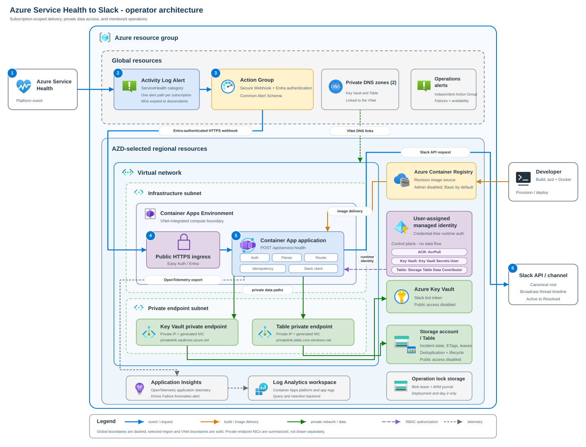

# Azure Service Health Slack Bot

This Flask service receives Azure Service Health notifications from an Azure
Monitor Secure Webhook Action Group and posts them to Slack. It keeps one root
message per subscription and tracking ID. Newer notifications update that root
and add a broadcast reply to its thread.

This is a community reference implementation. Azure Service Health remains the
source of truth. The service does not acknowledge incidents, open Azure support
requests, receive Slack events, or replace an incident management system.

## Start here

| Goal | Read |
|---|---|
| Evaluate the design | [Architecture](#architecture), [Security model](#security-model), and [Known limits](#known-limits) |
| Run locally | [Local development](#local-development) |
| Deploy | [Deploy with Azure Developer CLI](#deploy-with-azure-developer-cli) |
| Add subscriptions | [Manage alert scopes](#manage-alert-scopes) |
| Operate or troubleshoot | [Operations](#operations) |
| Check the Microsoft platform evidence | [Microsoft platform evidence](docs/microsoft-platform-evidence.md) |

## Architecture

The deployment uses Azure Container Apps, Azure Container Registry, a
user-assigned managed identity, Key Vault, Azure Table Storage, Log Analytics,
and workspace-based Application Insights.

Azure Monitor matches Service Health events in a subscription Activity Log and
sends the Common Alert Schema payload to the public Container Apps endpoint.
Container Apps authentication validates the Microsoft Entra token. The
application then verifies the Azure Monitor caller application, token audience,
and `ActionGroupsSecureWebhook` app role before parsing the payload.

Key Vault and Table Storage have public network access disabled. The Container
Apps environment reaches both services through private endpoints and private
DNS. The webhook and health probes still use the Container App's public HTTPS
ingress.



The diagram is an example deployment in East US 2. All regional resources use
the AZD location selected during provisioning. The Activity Log Alert, Action
Group, and private DNS zones use the Azure `Global` location.

### Main resources

| Resource | Purpose |
|---|---|
| Container App | Runs the Flask service with public HTTPS ingress, one to three replicas, and single revision mode. |
| Container Apps environment | Provides the VNet-integrated compute boundary and sends platform logs to Log Analytics. |
| Action Group | Sends a Microsoft Entra authenticated Secure Webhook request using Common Alert Schema. |
| Activity Log Alert | Matches `category = ServiceHealth` for one subscription. |
| User-assigned managed identity | Pulls the image and accesses Key Vault and Table Storage without application credentials. |
| Key Vault | Stores the Slack bot token and exposes it to Container Apps through a Key Vault secret reference. |
| Storage account and table | Stores incident state, Slack timestamps, ETags, and processing leases. |
| Private endpoints and DNS zones | Provide private Key Vault and Table Storage data paths. |
| Container Registry | Stores the application image. Registry admin access and anonymous pull are disabled. |
| Application Insights and Log Analytics | Receive application telemetry and Container Apps logs. |

Application Insights can also create a platform-managed Failure Anomalies smart
detection rule. That rule is not part of the Service Health delivery path.

## HTTP routes

| Route | Access | Purpose |
|---|---|---|
| `POST /api/service-health` | Microsoft Entra token plus application checks | Receives Common Alert Schema notifications. |
| `GET /healthz` | Public | Reports process liveness. |
| `GET /readyz` | Public | Confirms required configuration and client construction. |

`/readyz` does not perform a Table Storage transaction. Use an accepted test
notification and Application Insights dependency telemetry to verify managed
identity, private DNS, and Table data-plane access.

## Service Health payload mapping

Azure Monitor places common fields in `data.essentials` and the Activity Log
event in `data.alertContext`. This service requires:

- `schemaId = azureMonitorCommonAlertSchema`
- `alertContext.eventSource = ServiceHealth`
- a subscription ID in `alertContext.subscriptionId`, `essentials.alertId`, or
  `essentials.alertTargetIDs`
- `properties.trackingId`, `title`, `communication`, `impactStartTime`, and
  `impactedServices`
- `alertContext.level`
- `submissionTimestamp` or `eventTimestamp`

Microsoft documents `properties.impactedServices` as an escaped JSON string.
The parser also accepts an already-decoded list for compatibility. Each service
contains `ServiceName` and `ImpactedRegions`, whose entries contain
`RegionName`.

Microsoft documents Activity Log status values such as `Active` and `Resolved`,
with additional stage values that depend on the incident type. `Updated` in
this application is a local lifecycle label: a newer accepted nonterminal
notification for an existing Slack incident is rendered as an update. It is
not presented as a complete list of Azure Service Health stage values.

See the official [Common Alert Schema](https://learn.microsoft.com/azure/azure-monitor/alerts/alerts-common-schema)
and [Service Health event properties](https://learn.microsoft.com/azure/service-health/service-health-event-properties).

## Routing

Set either `SERVICE_HEALTH_ROUTES_JSON` or
`SERVICE_HEALTH_ROUTES_FILE`. The example is
`config/service_health_routes.example.json`.

`default_channel_id` is required. Rules can filter by `subscription_ids`,
`services`, and `regions`. Every filter supplied by a rule must match. The
highest priority wins, followed by the most specific rule and then file order.
The first selected channel is stored with the incident and remains fixed for
that incident.

Use Slack channel IDs, not names. The bot must be a member of every destination
channel unless you grant the broader `chat:write.public` scope. This guide uses
only `chat:write` and explicit channel membership.

## Idempotency and lifecycle

The Table entity key is the normalized subscription ID plus a SHA-256 hash of
the tracking ID. ETags and a 30-second lease coordinate concurrent replicas.

The first accepted notification calls `chat.postMessage`. Each newer accepted
notification updates the root with `chat.update`, checkpoints the root state,
and posts a broadcast thread reply. Identical notifications and notifications
at or below the stored submission watermark return `200` without calling Slack.

Transient Slack or Storage failures return `503`, which is one of the status
codes Azure Monitor treats as retryable for webhooks. Invalid payloads and
permanent Slack errors return a nonretryable `4xx`.

## Security model

### Webhook authentication

The Action Group uses Secure Webhook authentication. The preprovision hook:

1. Creates or loads the protected API app registration by persisted object and
   client IDs.
2. Configures Microsoft Entra v2 access tokens and the
   `api://<client-id>` identifier URI.
3. Creates an application-only `ActionGroupsSecureWebhook` app role.
4. Ensures service principals exist for the API and the official Azure Monitor
   AzNS AAD Webhook application
   (`461e8683-5575-4561-ac7f-899cc907d62a`).
5. Adds the deployment caller and AzNS service principal as verified owners.
6. Assigns the app role to the AzNS service principal.

The official Secure Webhook procedure requires the Microsoft Entra
`Application Administrator` role to configure this relationship. This is a
deployment-time role, not a runtime permission.

Container Apps authentication accepts the API client ID and its identifier URI
as audiences and restricts the authenticated application to AzNS. The Flask
application independently checks the caller application claim, audience, and
app role from the Easy Auth principal header.

`globalValidation.unauthenticatedClientAction` is `AllowAnonymous` so the public
health probes work. The Flask webhook route returns `401` when the Easy Auth
principal is absent and `403` when its claims do not meet the application
policy.

### Managed identity and RBAC

The deployment creates these direct role assignments for one user-assigned
managed identity:

| Scope | Role | Use |
|---|---|---|
| Container Registry | `AcrPull` | Pull the application image. |
| Key Vault | `Key Vault Secrets User` | Resolve the Slack token reference. |
| Storage account | `Storage Table Data Contributor` | Read and write incident entities. |

The application uses `ManagedIdentityCredential` with `AZURE_CLIENT_ID` in
production and staging. It uses `DefaultAzureCredential` for local development.
Storage shared-key access is disabled.

### Network boundaries

Key Vault and Storage set `publicNetworkAccess` to `Disabled`. Each service has
a private endpoint and private DNS zone linked to the Container Apps VNet. The
Container Registry and Application Insights ingestion endpoints remain public
Azure endpoints.

The Bicep private DNS suffixes and the documented Service Health Secure Webhook
flow target Azure public cloud. Do not assume this template works unchanged in
a sovereign cloud.

## Known limits

- There is a crash window after Slack accepts a write and before Table Storage
  records its timestamp. An initial post can leave an untracked root, and a
  thread reply can be duplicated on replay.
- Slack does not provide a downstream idempotency key for these message calls,
  so the service cannot guarantee exactly-once delivery across Slack and Table
  Storage.
- The deployment pins a versioned Key Vault secret URI. Rotate the token through
  AZD and run provisioning so the Container App reference moves to the new
  secret version.
- The bootstrap workflow stores `SLACK_BOT_TOKEN` as plaintext in
  `.azure/<environment>/.env` because the target Key Vault does not exist before
  the first provision. The current template requires that local value for every
  later provision and can overwrite a direct Key Vault rotation. This plaintext
  dependency is a production deployment blocker until the infrastructure
  supports an external vault or a two-phase flow.
- The day-2 command implements a Management Group as one managed subscription
  alert path per accessible descendant. It does not deploy one native
  Management Group Activity Log Alert.
- The templates use Azure public cloud endpoint suffixes.

## Prerequisites

For deployment:

- Python 3.13
- current stable [Azure CLI](https://learn.microsoft.com/cli/azure/install-azure-cli)
  with Bicep
- current stable [Azure Developer CLI](https://learn.microsoft.com/azure/developer/azure-developer-cli/install-azd)
- Docker with a Linux container engine
- a dedicated Slack app with token rotation disabled, an `xoxb-` bot token, and
  `chat:write`
- an Azure subscription where you can create the resources in `infra/`
- `Owner`, or `Contributor` plus `User Access Administrator`, at the target
  subscription so Bicep can create resources and role assignments
- Microsoft Entra `Application Administrator` while the Secure Webhook hook runs

The documented Bash commands work in Linux, macOS where the command syntax is
available, and Ubuntu on WSL. On WSL, keep the repository in the Linux file
system, such as `~/src`, rather than a mounted Windows drive under `/mnt`.
Microsoft documents that Linux permission metadata is not enabled by default on
DrvFS, so `chmod 600` alone does not provide the expected POSIX file mode there.
See [File Permissions for WSL](https://learn.microsoft.com/windows/wsl/file-permissions).
Stage 1 pins the Azure subscription and AZD environment before registering the
Container Apps resource providers.

`Microsoft.ContainerService` is the Azure Kubernetes Service namespace and is
not a general Container Apps prerequisite for this deployment.

## Local development

Create a virtual environment and install dependencies:

```bash
python -m venv .venv
source .venv/bin/activate
python -m pip install --upgrade pip
python -m pip install -r requirements.txt
```

On Windows, use Ubuntu on WSL and run the Bash commands above. Native Windows
shell commands are outside this repository's supported operational surface.

After activation, `python`, `python -m pip`, and the test commands use the
virtual environment. Activate it again in each new shell.

Copy `.env-example` to `.env`, then set:

- `SLACK_BOT_TOKEN`
- `AZURE_TABLE_ENDPOINT`
- one routing source
- `SERVICE_HEALTH_EXPECTED_AUDIENCE` only when `APP_ENV` is not
  `development` or `test`

The example routing file uses synthetic channel and subscription IDs. For local
Table access, sign in with an identity that has Storage Table data permissions:

```bash
az login
python app.py
```

Build the production image with:

```bash
docker build -t azure-service-health-slack-bot .
```

The Docker build retries package download through Microsoft's Python package
proxy if the configured package index fails. Override `PIP_INDEX_URL` or
`PIP_FALLBACK_INDEX_URL` with Docker build arguments when required by your
network policy.

## Deploy with Azure Developer CLI

Use the stages in order. Each checkpoint is a stop/go decision. Do not continue
when a checkpoint fails, even if a later command appears able to run.

The examples use placeholders. Set them only in your local shell and AZD
environment. Do not add real tenant IDs, subscription IDs, user names, Slack
tokens, or channel IDs to tracked files.

### Stage 0: verify the workstation

Prerequisites:

- Bash on Linux, macOS, or Ubuntu on WSL
- Python 3.13
- current stable Azure CLI with Bicep
- current stable Azure Developer CLI
- Docker with a running Linux container engine
- Git

Run:

```bash
python --version
az version
az bicep version
azd version
docker version --format 'client={{.Client.Version}} server={{.Server.Version}}'
docker info --format 'os={{.OSType}}'
git --version
```

Expected state:

- Python reports `3.13.x`.
- AZD reports `1.30.0` or a later stable version. The deployment commands in
  this guide were checked against the 1.30 command reference.
- Every command exits with status `0`.
- Docker reports both a client and server version.
- Docker reports `os=linux`.

Checkpoint: stop until all six tools respond successfully. A Docker client
version without a server version is not sufficient.

Recovery:

- Install or update the tool from the links in [Prerequisites](#prerequisites).
- On WSL, enable the distribution in Docker Desktop under **WSL integration**,
  then rerun `docker info`.
- If `az bicep version` fails, run `az bicep install` and repeat the check.

### Stage 1: pin the Azure and AZD deployment target

Prerequisites:

- a local directory where the repository can be cloned; on WSL this must be in
  the Linux file system, not under `/mnt`;
- the target tenant ID;
- the target subscription ID;
- a supported Azure region;
- an active `Owner` assignment, or `Contributor` plus
  `User Access Administrator`, on the target subscription;
- an active Microsoft Entra `Application Administrator` directory role for the
  operator who runs the Secure Webhook hook.

Choose a short environment name with lowercase letters, numbers, and hyphens.
Keep it between 3 and 20 characters and begin and end with a letter or number.

Clone the repository, then replace every angle-bracket placeholder:

```bash
mkdir -p "$HOME/src"
cd "$HOME/src"
git clone https://github.com/ricmmartins/azure-service-health-slack-bot.git
cd azure-service-health-slack-bot

export TARGET_TENANT_ID="<tenant-id>"
export TARGET_SUBSCRIPTION_ID="<subscription-id>"
export AZURE_LOCATION="<azure-region>"
export AZURE_ENV_NAME="<environment-name>"

az login --tenant "$TARGET_TENANT_ID"
az account set --subscription "$TARGET_SUBSCRIPTION_ID"
azd auth login --tenant-id "$TARGET_TENANT_ID"

azd env new "$AZURE_ENV_NAME" \
  --subscription "$TARGET_SUBSCRIPTION_ID" \
  --location "$AZURE_LOCATION" \
  --no-prompt
azd env select "$AZURE_ENV_NAME" --no-prompt

az account show \
  --query '{tenant:tenantId,subscription:id,name:name,isDefault:isDefault}' \
  -o table
azd auth status
azd env list -e "$AZURE_ENV_NAME" --no-prompt

OPERATOR_OBJECT_ID="$(az ad signed-in-user show --query id -o tsv)"
az role assignment list \
  --assignee "$OPERATOR_OBJECT_ID" \
  --scope "/subscriptions/$TARGET_SUBSCRIPTION_ID" \
  --include-groups \
  --include-inherited \
  --query '[].{role:roleDefinitionName,scope:scope}' \
  -o table
```

Expected state:

- `tenant` and `subscription` match the values you supplied.
- `isDefault` is `True`.
- AZD reports an authenticated user in the same tenant.
- AZD lists `AZURE_ENV_NAME` as the selected environment.
- The selected AZD environment contains the supplied subscription and location.
- The role table shows the required active Azure role combination. Microsoft
  Entra directory roles do not appear in this Azure RBAC table, so confirm the
  active `Application Administrator` role separately in the Entra admin center.

Verify both tools point to the same target before making any subscription or
directory change:

```bash
if ! (
  test "$(az account show --query tenantId -o tsv)" = "$TARGET_TENANT_ID" &&
  test "$(az account show --query id -o tsv)" = "$TARGET_SUBSCRIPTION_ID" &&
  test "$(azd env get-value AZURE_ENV_NAME \
    -e "$AZURE_ENV_NAME" --no-prompt)" = "$AZURE_ENV_NAME" &&
  test "$(azd env get-value AZURE_SUBSCRIPTION_ID \
    -e "$AZURE_ENV_NAME" --no-prompt)" = \
    "$TARGET_SUBSCRIPTION_ID" &&
  test "$(azd env get-value AZURE_LOCATION \
    -e "$AZURE_ENV_NAME" --no-prompt)" = "$AZURE_LOCATION"
); then
  echo "Azure CLI and AZD target confirmation failed." >&2
  exit 1
fi
echo "deployment-target-pinned"
```

Proceed only when the final line is `deployment-target-pinned`. Register and
check the Container Apps providers only after this checkpoint:

```bash
az provider register --namespace Microsoft.App --wait
az provider register --namespace Microsoft.OperationalInsights --wait
az provider show --namespace Microsoft.App \
  --query '{namespace:namespace,state:registrationState}' -o table
az provider show --namespace Microsoft.OperationalInsights \
  --query '{namespace:namespace,state:registrationState}' -o table
```

Checkpoint:

```bash
test "$(az provider show --namespace Microsoft.App \
  --query registrationState -o tsv)" = "Registered" &&
test "$(az provider show --namespace Microsoft.OperationalInsights \
  --query registrationState -o tsv)" = "Registered" &&
echo "azure-context-ready"
```

Proceed only when the final line is `azure-context-ready`.

Recovery:

- If the account values are wrong, rerun
  `az login --tenant "$TARGET_TENANT_ID"` and
  `az account set --subscription "$TARGET_SUBSCRIPTION_ID"`; do not rely on a
  previous shell context.
- If `azd env new` reports that the environment already exists, run
  `azd env select "$AZURE_ENV_NAME" --no-prompt`, then rerun the complete
  `deployment-target-pinned` checkpoint. Do not assume the existing
  subscription and location are correct.
- Correct a wrong unused environment binding before any hook or provisioning
  command with
  `azd env set AZURE_SUBSCRIPTION_ID "$TARGET_SUBSCRIPTION_ID" -e "$AZURE_ENV_NAME"`
  and
  `azd env set AZURE_LOCATION "$AZURE_LOCATION" -e "$AZURE_ENV_NAME"`.
- If a role is eligible through Privileged Identity Management, activate it and
  rerun the role query.
- If provider registration is forbidden, ask a subscription administrator to
  register the namespaces. Do not substitute `Microsoft.ContainerService`.
- On WSL, if the repository was cloned under `/mnt`, remove any local secret
  data from that copy and clone again under `~/src` before stage 4.

### Stage 2: create and authorize the Slack app

Prerequisites:

- permission to create or approve an app in the target Slack workspace;
- one destination channel ID for the fallback route;
- any additional destination channel IDs needed by routing rules.

Use a dedicated Slack app for this deployment. Reusing an app couples its
credential lifecycle and channel access to every other consumer.

In <https://api.slack.com/apps>:

1. Create a dedicated Slack app in the target workspace.
2. Under **OAuth & Permissions**, add the bot scope `chat:write`.
3. In **OAuth & Permissions**, confirm token rotation is disabled. Do not enable
   it for this application.
4. Install or reinstall the app to the workspace.
5. Store the resulting `xoxb-` bot token in an approved password manager.
6. Invite the bot to every destination channel.
7. Open each channel's details and record its channel ID.

Expected state: you have one `xoxb-` token and every configured channel shows
the bot as a member. Token rotation is disabled. The service does not need a
signing secret, event subscription, slash command, or inbound app manifest.

Slack's [token rotation documentation](https://docs.slack.dev/authentication/using-token-rotation/)
states that rotating access tokens expire every 12 hours and must be refreshed
with a refresh token. This runtime stores one static `xoxb-` value and has no
OAuth client-secret or refresh-token flow. It does not support rotating
`xoxe.xoxb-*` access tokens.

Checkpoint: do not continue with only channel names. Routing requires channel
IDs, the bot must already be a channel member when using only `chat:write`, and
token rotation must be disabled. If an existing app has token rotation enabled,
stop and create a dedicated app without it. Slack states that token rotation
cannot be disabled after it is enabled.

Recovery:

- If app installation is blocked, request workspace administrator approval.
- If a channel is private, have a member invite the bot.
- If you changed scopes after installation, reinstall the app before using the
  new token.
- If the app is shared, record every owner and consumer before proceeding.
  Prefer replacing it with a dedicated app for this deployment.

### Stage 3: install dependencies and validate the routing file

Prerequisites: stages 0 through 2 are complete.

Run:

```bash
python -m venv .venv
source .venv/bin/activate
python -m pip install --upgrade pip
python -m pip install -r requirements.txt

cp config/service_health_routes.example.json \
  config/service_health_routes.json
vi config/service_health_routes.json
```

Replace every synthetic channel and subscription ID. Keep
`default_channel_id`; it is required. Then validate both JSON syntax and the
application routing contract:

```bash
python -m json.tool config/service_health_routes.json >/dev/null &&
python -c 'import json; from pathlib import Path; from service_health.routing import RoutingConfig; RoutingConfig.from_dict(json.loads(Path("config/service_health_routes.json").read_text())); print("routing-valid")' &&
! grep -Eq \
  'C0123456789|C1111111111|C2222222222|00000000-0000-0000-0000-000000000000' \
  config/service_health_routes.json &&
echo "routing-checkpoint-passed"
```

Expected state: the parser prints `routing-valid`, the placeholder scan is
silent, and the final line is `routing-checkpoint-passed`.

Checkpoint: inspect the file once more and confirm that its subscription IDs
belong to the intended tenant and its channel IDs belong to the intended Slack
workspace.

Recovery:

- A `JSONDecodeError` identifies malformed JSON. Correct the indicated line and
  rerun both validators.
- `InvalidRoutingConfiguration` identifies a missing channel, invalid rule, or
  invalid priority.
- If the placeholder scan stops the command before the final line, replace the
  remaining example value.

### Stage 4: load inputs into the pinned AZD environment

Prerequisites:

- the shell variables from stage 1 are still set;
- the terminal is in the repository root;
- the validated routing file from stage 3 exists;
- the Slack bot token is available from the approved password manager.

Reselect and verify the deployment target, then load the two deployment inputs:

```bash
az account set --subscription "$TARGET_SUBSCRIPTION_ID"
azd env select "$AZURE_ENV_NAME" --no-prompt
if ! (
  test "$(az account show --query tenantId -o tsv)" = "$TARGET_TENANT_ID" &&
  test "$(az account show --query id -o tsv)" = "$TARGET_SUBSCRIPTION_ID" &&
  test "$(azd env get-value AZURE_SUBSCRIPTION_ID \
    -e "$AZURE_ENV_NAME" --no-prompt)" = \
    "$TARGET_SUBSCRIPTION_ID" &&
  test "$(azd env get-value AZURE_LOCATION \
    -e "$AZURE_ENV_NAME" --no-prompt)" = "$AZURE_LOCATION"
); then
  echo "Azure CLI and AZD do not target the same deployment." >&2
  exit 1
fi
echo "deployment-target-reconfirmed"

AZD_ENV_DIR=".azure/$AZURE_ENV_NAME"
if grep -qi microsoft /proc/sys/kernel/osrelease 2>/dev/null; then
  if ! WSL_FS_ID="$(
    stat -f -c '%T:%t' -- "$AZD_ENV_DIR" 2>/dev/null
  )"; then
    echo "Could not identify the AZD environment file system on WSL." >&2
    exit 1
  fi
  case "$WSL_FS_ID" in
    drvfs:*|9p:*|*:53464846|*:1021997)
      echo "The AZD environment is on DrvFS; use the WSL Linux file system." >&2
      exit 1
      ;;
  esac
  unset WSL_FS_ID
fi
echo "local-secret-path-confirmed"

AZD_ENV_FILE="$AZD_ENV_DIR/.env"
cleanup_local_slack_token() {
  local cleanup_file
  local old_umask
  old_umask="$(umask)"
  umask 077
  if ! cleanup_file="$(mktemp "${AZD_ENV_FILE}.cleanup.XXXXXX")"; then
    umask "$old_umask"
    return 1
  fi
  umask "$old_umask"
  if ! awk '!/^SLACK_BOT_TOKEN=/' "$AZD_ENV_FILE" >"$cleanup_file" ||
     ! mv -f "$cleanup_file" "$AZD_ENV_FILE"; then
    rm -f "$cleanup_file"
    return 1
  fi
}
abort_secret_stage() {
  local reason="$1"
  if cleanup_local_slack_token; then
    echo "$reason The stored Slack token was removed." >&2
  else
    echo "$reason Automatic Slack token cleanup also failed." >&2
  fi
  exit 1
}

read -rsp "Slack bot token (input hidden): " SLACK_BOT_TOKEN; printf '\n'
while [[ "$SLACK_BOT_TOKEN" != xoxb-* ]]; do
  unset SLACK_BOT_TOKEN
  echo "Expected an xoxb token; try again." >&2
  read -rsp "Slack bot token (input hidden): " SLACK_BOT_TOKEN; printf '\n'
done
if ! azd env set SLACK_BOT_TOKEN "$SLACK_BOT_TOKEN" \
  -e "$AZURE_ENV_NAME" --no-prompt; then
  unset SLACK_BOT_TOKEN
  echo "Could not store the Slack token in the selected AZD environment." >&2
  exit 1
fi
unset SLACK_BOT_TOKEN

if ! ROUTES_B64="$(
  python -c 'import base64, pathlib; print(base64.b64encode(pathlib.Path("config/service_health_routes.json").read_bytes()).decode())'
)"; then
  abort_secret_stage "Could not encode the routing file."
fi
if ! azd env set SERVICE_HEALTH_ROUTES_JSON_B64 "$ROUTES_B64" \
  -e "$AZURE_ENV_NAME" --no-prompt; then
  unset ROUTES_B64
  abort_secret_stage \
    "Could not store routing in the selected AZD environment."
fi
unset ROUTES_B64
if ! chmod 600 "$AZD_ENV_FILE"; then
  abort_secret_stage "Could not restrict the local AZD environment file."
fi
if ! ENV_FILE_MODE="$(
  python -c 'import os, sys; print(oct(os.stat(sys.argv[1]).st_mode & 0o777)[2:])' \
    "$AZD_ENV_FILE"
)"; then
  abort_secret_stage "Could not verify the local AZD environment file mode."
fi
if [[ "$ENV_FILE_MODE" != "600" ]]; then
  unset ENV_FILE_MODE
  abort_secret_stage "The local AZD environment file mode is not 600."
fi
unset ENV_FILE_MODE
if ! (
  test "$(azd env get-value AZURE_ENV_NAME \
    -e "$AZURE_ENV_NAME" --no-prompt)" = "$AZURE_ENV_NAME" &&
  test "$(azd env get-value AZURE_SUBSCRIPTION_ID \
    -e "$AZURE_ENV_NAME" --no-prompt)" = \
    "$TARGET_SUBSCRIPTION_ID" &&
  test "$(azd env get-value AZURE_LOCATION \
    -e "$AZURE_ENV_NAME" --no-prompt)" = "$AZURE_LOCATION" &&
  grep -q '^SLACK_BOT_TOKEN=' "$AZD_ENV_FILE" &&
  grep -q '^SERVICE_HEALTH_ROUTES_JSON_B64=' "$AZD_ENV_FILE"
); then
  abort_secret_stage "The AZD environment checkpoint failed."
fi
echo "azd-environment-ready"
```

Expected state:

- `.azure/<environment-name>/.env` exists.
- the command prints `deployment-target-reconfirmed` and
  `local-secret-path-confirmed`;
- the local environment contains the two required keys without printing their
  values, and the command prints `azd-environment-ready`.

Proceed only when the final line is `azd-environment-ready`.

Hidden input prevents terminal echo, and the command history contains only the
variable name. The expanded token is still passed to the local `azd` process
and stored as plaintext in the selected AZD environment file. This bootstrap
design does not meet Microsoft's preferred AZD secret-reference pattern because
the target vault is created by the same provision. Restrict access to the
workstation and `.azure/<environment>/.env`, never commit or copy the
environment, and do not run `azd env get-values` in logs.

On a later failure, cleanup filters only the exact `SLACK_BOT_TOKEN=` line. It
does not retrieve or print the stored value, and it preserves every other
environment entry.

The routing document is base64 encoded because AZD substitutes parameter values
into `infra/main.parameters.json` before JSON parsing. Bicep decodes the value
before setting the container's plain JSON
`SERVICE_HEALTH_ROUTES_JSON` environment variable.

Recovery:

- Stop before entering the token if `deployment-target-reconfirmed` does not
  print. Repeat the stage 1 account and environment recovery.
- On WSL, stop if `local-secret-path-confirmed` does not print. Clone a clean
  copy under `~/src` and repeat from stage 1.
- If routing persistence, permission enforcement, or a later check fails after
  the token is stored, the stage removes only the local `SLACK_BOT_TOKEN`
  entry. Fix the reported error and rerun the whole stage.
- Repeat the hidden token input if the wrong token was stored.
- If the wrong environment name was used and no hook or provisioning command
  has run, create a new environment with the correct name and remove the unused
  local environment with
  `azd env remove "<wrong-environment-name>" -e "<wrong-environment-name>" --force --no-prompt`.

### Stage 5: reconcile Microsoft Entra and preview Azure changes

Prerequisites:

- the stage 4 checkpoint passed;
- `Application Administrator` is active for the Azure CLI user;
- the operator can create enterprise applications in the target tenant.

The hook reads the active Azure CLI account through `az account show` and can
change Microsoft Entra. Set and verify the Azure CLI subscription again, then
reselect the AZD environment before running it:

```bash
az account set --subscription "$TARGET_SUBSCRIPTION_ID"
azd env select "$AZURE_ENV_NAME" --no-prompt
if ! (
  test "$(az account show --query tenantId -o tsv)" = "$TARGET_TENANT_ID" &&
  test "$(az account show --query id -o tsv)" = "$TARGET_SUBSCRIPTION_ID" &&
  test "$(azd env get-value AZURE_ENV_NAME \
    -e "$AZURE_ENV_NAME" --no-prompt)" = "$AZURE_ENV_NAME" &&
  test "$(azd env get-value AZURE_SUBSCRIPTION_ID \
    -e "$AZURE_ENV_NAME" --no-prompt)" = \
    "$TARGET_SUBSCRIPTION_ID" &&
  test "$(azd env get-value AZURE_LOCATION \
    -e "$AZURE_ENV_NAME" --no-prompt)" = "$AZURE_LOCATION"
); then
  echo "Entra mutation target confirmation failed." >&2
  exit 1
fi
echo "entra-mutation-target-confirmed"
```

Do not run the hook unless the final line is
`entra-mutation-target-confirmed`. Run the project hook explicitly:

```bash
azd hooks run preprovision \
  -e "$AZURE_ENV_NAME" \
  --no-prompt
```

Expected state: the hook exits with status `0` after creating or reconciling the
protected API application, service principal, identifier URI,
`ActionGroupsSecureWebhook` role, verified owners, and AzNS role assignment.
This stage changes Microsoft Entra, but does not provision the Azure resources.

Check the nonsecret hook outputs without printing the local Slack token:

```bash
test -n "$(azd env get-value SERVICE_HEALTH_API_CLIENT_ID \
  -e "$AZURE_ENV_NAME" --no-prompt)" &&
test -n "$(azd env get-value SERVICE_HEALTH_API_OBJECT_ID \
  -e "$AZURE_ENV_NAME" --no-prompt)" &&
test -n "$(azd env get-value SERVICE_HEALTH_API_IDENTIFIER_URI \
  -e "$AZURE_ENV_NAME" --no-prompt)" &&
echo "entra-hook-ready"
```

Preview the Azure Resource Manager changes:

```bash
azd provision --preview \
  -e "$AZURE_ENV_NAME" \
  --subscription "$TARGET_SUBSCRIPTION_ID" \
  --location "$AZURE_LOCATION" \
  --no-prompt
```

Expected state: preview exits with status `0`, shows planned creates for the
central resources, and shows no unexpected deletes or changes outside the
selected subscription.

The named AZD environment was created with an explicit subscription and
location, and preview repeats both values. The first `--no-prompt` preview
therefore does not depend on cached AZD defaults or an earlier interactive
selection.

Checkpoint: proceed only after `entra-mutation-target-confirmed` and
`entra-hook-ready` appear and a human has reviewed the complete preview. Save
the preview in an approved operational record if your change process requires
it, but redact local paths and IDs before sharing.

Microsoft documents the preview flag and independent hook execution. It does
not document a guarantee about whether preview invokes lifecycle hooks. The
explicit hook command is therefore a project requirement, not a general AZD
platform claim.

Recovery:

- A directory authorization error usually means `Application Administrator` is
  inactive or the Azure CLI signed into the wrong tenant. Correct the context
  and rerun the hook; it is designed to reconcile existing objects.
- If the hook reports conflicting persisted application IDs, stop and inspect
  the named app registration. Do not delete an existing application to force a
  clean run.
- If preview shows a delete or the wrong subscription, stop, correct the AZD
  environment binding, and rerun preview.

### Stage 6: provision the Azure resources

Prerequisites: the stage 5 preview was reviewed and approved.

Run:

```bash
azd provision \
  -e "$AZURE_ENV_NAME" \
  --subscription "$TARGET_SUBSCRIPTION_ID" \
  --location "$AZURE_LOCATION" \
  --no-prompt
```

Expected state: AZD reports successful provisioning and writes nonsecret Bicep
outputs to the selected environment. The resource group contains the network,
private endpoints, Log Analytics, Application Insights, Key Vault, token
secret, Storage account and table, Container Registry, managed identity,
Container Apps environment and app, Action Group, and baseline Activity Log
Alert.

Capture outputs and inspect the central resources:

```bash
RESOURCE_GROUP="$(azd env get-value AZURE_RESOURCE_GROUP \
  -e "$AZURE_ENV_NAME" --no-prompt)"
APP_NAME="$(azd env get-value SERVICE_APP_NAME \
  -e "$AZURE_ENV_NAME" --no-prompt)"
APP_URI="$(azd env get-value SERVICE_APP_URI \
  -e "$AZURE_ENV_NAME" --no-prompt)"
ACTION_GROUP="ag-${AZURE_ENV_NAME}-service-health"

test -n "$RESOURCE_GROUP"
test -n "$APP_NAME"
test -n "$APP_URI"
az group show --name "$RESOURCE_GROUP" \
  --query '{name:name,location:location,state:properties.provisioningState}' \
  -o table
az containerapp show --resource-group "$RESOURCE_GROUP" --name "$APP_NAME" \
  --query '{name:name,state:properties.provisioningState,external:properties.configuration.ingress.external}' \
  -o table
az monitor action-group show \
  --resource-group "$RESOURCE_GROUP" \
  --name "$ACTION_GROUP" \
  --query '{location:location,enabled:enabled,aad:webhookReceivers[0].useAadAuth,commonSchema:webhookReceivers[0].useCommonAlertSchema}' \
  -o table
```

Run the machine checkpoint:

```bash
test -n "$RESOURCE_GROUP" &&
test -n "$APP_NAME" &&
test -n "$APP_URI" &&
test "$(az group show --name "$RESOURCE_GROUP" \
  --query properties.provisioningState -o tsv)" = "Succeeded" &&
test "$(az containerapp show --resource-group "$RESOURCE_GROUP" \
  --name "$APP_NAME" \
  --query properties.provisioningState -o tsv)" = "Succeeded" &&
test "$(az containerapp show --resource-group "$RESOURCE_GROUP" \
  --name "$APP_NAME" \
  --query properties.configuration.ingress.external -o tsv)" = "true" &&
test "$(az monitor action-group show --resource-group "$RESOURCE_GROUP" \
  --name "$ACTION_GROUP" --query location -o tsv | \
  tr '[:upper:]' '[:lower:]')" = "global" &&
test "$(az monitor action-group show --resource-group "$RESOURCE_GROUP" \
  --name "$ACTION_GROUP" --query enabled -o tsv)" = "true" &&
test "$(az monitor action-group show --resource-group "$RESOURCE_GROUP" \
  --name "$ACTION_GROUP" \
  --query 'webhookReceivers[0].useAadAuth' -o tsv)" = "true" &&
test "$(az monitor action-group show --resource-group "$RESOURCE_GROUP" \
  --name "$ACTION_GROUP" \
  --query 'webhookReceivers[0].useCommonAlertSchema' -o tsv)" = "true" &&
echo "azure-resources-ready"
```

Expected checkpoint values:

- the resource group and Container App provisioning states are `Succeeded`;
- Container App external ingress is `True`;
- the Action Group location is `Global`;
- `enabled`, `aad`, and `commonSchema` are `True`.

Checkpoint: do not deploy application code until all expected values are
present and the machine checkpoint prints `azure-resources-ready`. Provisioning
success alone is not enough if the Action Group contract is wrong.

Keep `SLACK_BOT_TOKEN` in the protected local AZD environment after provision.
The current Bicep contract requires it on every `azd provision` and writes the
supplied value as a new versioned Key Vault secret. Removing the local value
would make the next provision incomplete, while setting it to an empty string
could create an empty secret version.

Do not rotate `slack-bot-token` directly in Key Vault. A later provision can
overwrite that rotation with the token retained by AZD. Use the
[token rotation procedure](#rotate-the-slack-token), which updates the selected
AZD environment and provisions that same environment.

Keep `.azure/$AZURE_ENV_NAME/.env` at mode `600`. Do not copy it, commit it,
include it in support bundles, or run an AZD command that prints the token.
Removing plaintext persistence requires an infrastructure design change, such
as a preexisting external vault or a two-phase deployment. Complete that
hardening before production use; documentation alone cannot remove the current
bootstrap dependency.

Recovery:

- For `MissingSubscriptionRegistration`, register the namespace named in the
  error and rerun the same idempotent provision command.
- For role-assignment failures, verify the Azure RBAC assignments from stage 1
  and allow for propagation before retrying.
- For a regional capacity or policy error, do not change regions without a new
  preview. Update `AZURE_LOCATION`, rerun preview, and obtain approval again.

### Stage 7: build and deploy the application

Prerequisites:

- the stage 6 resource checkpoint passed;
- Docker still reports a running Linux server;
- the current directory is the repository root.

Run:

```bash
docker info --format 'os={{.OSType}}'
azd deploy -e "$AZURE_ENV_NAME" --no-prompt
```

Expected state: AZD builds the Docker image, pushes it to the deployed registry,
updates the Container App, and reports a successful service deployment.

Inspect active revisions:

```bash
az containerapp revision list \
  --resource-group "$RESOURCE_GROUP" \
  --name "$APP_NAME" \
  --query '[?properties.active].{name:name,active:properties.active,created:properties.createdTime}' \
  -o table

test "$(az containerapp revision list \
  --resource-group "$RESOURCE_GROUP" \
  --name "$APP_NAME" \
  --query 'length([?properties.active])' -o tsv)" = "1" &&
echo "application-revision-ready"
```

Checkpoint: single revision mode must show exactly one active revision and its
`active` value must be `True`. The final line must be
`application-revision-ready`.

Recovery:

- If Docker cannot connect, fix the engine before rerunning
  `azd deploy -e "$AZURE_ENV_NAME" --no-prompt`.
- If image push or pull fails, inspect the managed identity's `AcrPull` role and
  allow for role-assignment propagation.
- If the new revision does not become active, inspect
  `az containerapp logs show --resource-group "$RESOURCE_GROUP" --name "$APP_NAME" --type system --tail 100`
  before retrying or activating a known-good revision.

### Stage 8: verify probes and the authentication boundary

Prerequisites: stage 7 shows one active revision.

Run:

```bash
test "$(curl -fsS "$APP_URI/healthz")" = '{"status":"healthy"}' &&
test "$(curl -fsS "$APP_URI/readyz")" = '{"status":"ready"}' &&
HTTP_CODE="$(curl -sS -o /tmp/service-health-response.json -w '%{http_code}' \
  -X POST -H 'Content-Type: application/json' --data '{}' \
  "$APP_URI/api/service-health")" &&
test "$HTTP_CODE" = "401" &&
python3 -m json.tool /tmp/service-health-response.json &&
rm -f /tmp/service-health-response.json &&
echo "ingress-auth-checkpoint-passed"
```

Expected state:

- `/healthz` returns exactly `{"status":"healthy"}`;
- `/readyz` returns exactly `{"status":"ready"}`;
- an unauthenticated webhook request returns HTTP `401`;
- the final line is `ingress-auth-checkpoint-passed`.

Checkpoint: all three responses must match. A public `200` from the webhook is a
security failure and must block the signed test.

Recovery:

- A probe timeout points to ingress, revision, or startup failure. Inspect
  system and console logs.
- A readiness `503` points to missing required environment values or client
  construction failure.
- A webhook response other than `401` requires inspection of Container Apps
  authentication and Flask authorization before proceeding.

### Stage 9: send the signed Service Health test

Prerequisites:

- the stage 8 checkpoint passed;
- the bot is present in the configured Slack destination;
- the operator can invoke Action Group test notifications.

The Azure CLI test requires the receiver definition even though the Action
Group already exists:

```bash
URI="$(az monitor action-group show \
  --resource-group "$RESOURCE_GROUP" \
  --name "$ACTION_GROUP" \
  --query 'webhookReceivers[0].serviceUri' -o tsv)"
OBJECT_ID="$(az monitor action-group show \
  --resource-group "$RESOURCE_GROUP" \
  --name "$ACTION_GROUP" \
  --query 'webhookReceivers[0].objectId' -o tsv)"
IDENTIFIER_URI="$(az monitor action-group show \
  --resource-group "$RESOURCE_GROUP" \
  --name "$ACTION_GROUP" \
  --query 'webhookReceivers[0].identifierUri' -o tsv)"

test -n "$URI" &&
test -n "$OBJECT_ID" &&
test -n "$IDENTIFIER_URI" &&
az monitor action-group test-notifications create \
  --resource-group "$RESOURCE_GROUP" \
  --action-group-name "$ACTION_GROUP" \
  --alert-type servicehealth \
  --add-action webhook slack-service-health "$URI" \
    useaadauth "$OBJECT_ID" "$IDENTIFIER_URI" usecommonalertschema \
  --only-show-errors \
  -o json
```

Expected state: the Azure operation completes, the receiver succeeds, the
Container App records an HTTP `200` request, and a formatted Service Health root
message appears in the configured Slack channel. Microsoft REST examples show
`Completed`; live project tests have also returned operation state `Complete`
and receiver state `Succeeded`.

Inspect recent application logs:

```bash
az containerapp logs show \
  --resource-group "$RESOURCE_GROUP" \
  --name "$APP_NAME" \
  --type console \
  --tail 100
```

Checkpoint: deployment is accepted only when the signed test succeeds and the
Slack message appears in the intended channel. After telemetry arrives, use the
[Application Insights queries](#application-insights-queries) to confirm the
Table and Slack dependencies.

Recovery:

- A `401` or `403` indicates an audience, allowed-client, owner, or app-role
  mismatch. Reconcile the hook and inspect the Container Apps authentication
  settings.
- A signed HTTP `200` with no Slack message points to token, scope, routing, or
  channel membership.
- A `503` points to a transient Slack or Storage dependency failure. Inspect
  dependencies and retry only after correction.
- Do not repeat a failing test in a tight loop. Azure Monitor retries eligible
  failures and can suppress calls to the endpoint for 15 minutes after
  exhausting the retry sequence.

## Manage alert scopes

The initial deployment creates one alert for its subscription. Pin the central
environment and Azure CLI context before every day-2 command:

```bash
export AZURE_ENV_NAME="<environment-name>"
TARGET_TENANT_ID="$(
  azd env get-value AZURE_TENANT_ID \
    -e "$AZURE_ENV_NAME" --no-prompt
)"
TARGET_SUBSCRIPTION_ID="$(
  azd env get-value AZURE_SUBSCRIPTION_ID \
    -e "$AZURE_ENV_NAME" --no-prompt
)"
az account set --subscription "$TARGET_SUBSCRIPTION_ID"
if ! (
  test "$(az account show --query tenantId -o tsv)" = "$TARGET_TENANT_ID" &&
  test "$(az account show --query id -o tsv)" = "$TARGET_SUBSCRIPTION_ID" &&
  test "$(azd env get-value AZURE_ENV_NAME \
    -e "$AZURE_ENV_NAME" --no-prompt)" = "$AZURE_ENV_NAME"
); then
  echo "Day-2 target confirmation failed." >&2
  exit 1
fi
echo "day2-target-confirmed"
source .venv/bin/activate
```

Stop unless `day2-target-confirmed` prints. If Azure CLI is signed into another
tenant, run `az login --tenant "$TARGET_TENANT_ID"` and repeat the complete
check. List coverage or add a subscription with the environment name supplied
explicitly:

```bash
python scripts/manage_alert_scopes.py list \
  --environment-name "$AZURE_ENV_NAME"
python scripts/manage_alert_scopes.py add-subscription \
  --subscription-id "00000000-0000-0000-0000-000000000000" \
  --environment-name "$AZURE_ENV_NAME"
```

Management Group commands expand accessible descendants into managed
subscription alert paths:

```bash
python scripts/manage_alert_scopes.py add-management-group \
  --management-group-id "platform" \
  --environment-name "$AZURE_ENV_NAME"
python scripts/manage_alert_scopes.py migrate-to-management-group \
  --management-group-id "platform" \
  --environment-name "$AZURE_ENV_NAME" \
  --what-if
python scripts/manage_alert_scopes.py migrate-to-management-group \
  --management-group-id "platform" \
  --environment-name "$AZURE_ENV_NAME"
```

Always pass `--environment-name`; do not rely on discovery when more than one
deployment can exist. Use `--json` for machine-readable output.

Add operations support `--what-if`. Remove and migration operations require
interactive confirmation. `--force` supplies that confirmation only for
preapproved noninteractive automation; it does not bypass tenant, permission,
coverage, ownership, or signed-test checks.

The command checks the exact Azure operations it needs before mutation. A
typical assignment is `Contributor` on each target subscription plus
`Monitoring Contributor` at the Management Group scope used by a Management
Group command. The operator also needs enough read access to enumerate the
Management Group and every managed subscription. The command fails closed when
it cannot prove membership or coverage.

Each new path is deployed disabled, tested through Azure Monitor's signed
Secure Webhook test, and enabled only after the test succeeds. The AZD-owned
baseline alert remains outside day-2 ownership.

## Operations

### Application Insights queries

The application configures the Azure Monitor OpenTelemetry Distro with
`APPLICATIONINSIGHTS_CONNECTION_STRING`. Useful starting queries for a
workspace-based Application Insights resource are:

```kusto
AppRequests
| where Name has "/api/service-health"
| summarize count(), percentile(DurationMs, 95) by ResultCode

AppTraces
| where Message has "Service Health"
| project TimeGenerated, SeverityLevel, Message,
    rootMessageTs = Properties.message_ts,
    threadReplyTs = Properties.thread_reply_ts

AppDependencies
| where Target has_any ("slack.com", "table.core.windows.net")
| summarize count(), failures=countif(Success == false) by Target, ResultCode
```

Alert on sustained webhook `503` responses, dependency failures, and missing
successful deliveries when an incident is expected.

### Update routing

Routing is revision configuration, not image content. Confirm the tenant,
subscription, environment, and location immediately before changing it:

```bash
export AZURE_ENV_NAME="<environment-name>"
TARGET_TENANT_ID="$(
  azd env get-value AZURE_TENANT_ID \
    -e "$AZURE_ENV_NAME" --no-prompt
)"
TARGET_SUBSCRIPTION_ID="$(
  azd env get-value AZURE_SUBSCRIPTION_ID \
    -e "$AZURE_ENV_NAME" --no-prompt
)"
AZURE_LOCATION="$(
  azd env get-value AZURE_LOCATION \
    -e "$AZURE_ENV_NAME" --no-prompt
)"
az account set --subscription "$TARGET_SUBSCRIPTION_ID"
if ! (
  test "$(az account show --query tenantId -o tsv)" = "$TARGET_TENANT_ID" &&
  test "$(az account show --query id -o tsv)" = "$TARGET_SUBSCRIPTION_ID" &&
  test "$(azd env get-value AZURE_ENV_NAME \
    -e "$AZURE_ENV_NAME" --no-prompt)" = "$AZURE_ENV_NAME" &&
  test -n "$AZURE_LOCATION"
); then
  echo "Routing target confirmation failed." >&2
  exit 1
fi
echo "routing-target-confirmed"

if ! ROUTES_B64="$(
  python -c 'import base64, pathlib; print(base64.b64encode(pathlib.Path("config/service_health_routes.json").read_bytes()).decode())'
)"; then
  echo "Could not encode the routing file." >&2
  exit 1
fi
if ! azd env set SERVICE_HEALTH_ROUTES_JSON_B64 "$ROUTES_B64" \
  -e "$AZURE_ENV_NAME" --no-prompt; then
  unset ROUTES_B64
  echo "Could not store routing in the selected AZD environment." >&2
  exit 1
fi
unset ROUTES_B64

azd provision --preview \
  -e "$AZURE_ENV_NAME" \
  --subscription "$TARGET_SUBSCRIPTION_ID" \
  --location "$AZURE_LOCATION" \
  --no-prompt
```

Proceed only when preview succeeds and contains the intended routing change.
Provision the same explicit environment:

```bash
azd provision \
  -e "$AZURE_ENV_NAME" \
  --subscription "$TARGET_SUBSCRIPTION_ID" \
  --location "$AZURE_LOCATION" \
  --no-prompt
```

Stop unless `routing-target-confirmed` prints. Reprovisioning uses the current
Slack token retained in this AZD environment. Review preview before running the
second command.

### Rotate the Slack token

This procedure replaces a long-lived static `xoxb-` credential. It is not
Slack's expiring token rotation mode, which this runtime does not support. Keep
that Slack setting disabled.

Do not replace the token directly in Key Vault. Confirm the complete target,
update the selected AZD environment intentionally, then preview and provision
that same environment:

```bash
export AZURE_ENV_NAME="<environment-name>"
TARGET_TENANT_ID="$(
  azd env get-value AZURE_TENANT_ID \
    -e "$AZURE_ENV_NAME" --no-prompt
)"
TARGET_SUBSCRIPTION_ID="$(
  azd env get-value AZURE_SUBSCRIPTION_ID \
    -e "$AZURE_ENV_NAME" --no-prompt
)"
AZURE_LOCATION="$(
  azd env get-value AZURE_LOCATION \
    -e "$AZURE_ENV_NAME" --no-prompt
)"
az account set --subscription "$TARGET_SUBSCRIPTION_ID"
if ! (
  test "$(az account show --query tenantId -o tsv)" = "$TARGET_TENANT_ID" &&
  test "$(az account show --query id -o tsv)" = "$TARGET_SUBSCRIPTION_ID" &&
  test "$(azd env get-value AZURE_ENV_NAME \
    -e "$AZURE_ENV_NAME" --no-prompt)" = "$AZURE_ENV_NAME" &&
  test -n "$AZURE_LOCATION"
); then
  echo "Token rotation target confirmation failed." >&2
  exit 1
fi
echo "token-rotation-target-confirmed"

read -rsp "Replacement Slack bot token (input hidden): " SLACK_BOT_TOKEN
printf '\n'
if [[ "$SLACK_BOT_TOKEN" != xoxb-* ]]; then
  unset SLACK_BOT_TOKEN
  echo "Expected a nonempty xoxb token; stopping." >&2
  exit 1
fi
if ! azd env set SLACK_BOT_TOKEN "$SLACK_BOT_TOKEN" \
  -e "$AZURE_ENV_NAME" --no-prompt; then
  unset SLACK_BOT_TOKEN
  echo "Could not store the replacement token." >&2
  exit 1
fi
unset SLACK_BOT_TOKEN

azd provision --preview \
  -e "$AZURE_ENV_NAME" \
  --subscription "$TARGET_SUBSCRIPTION_ID" \
  --location "$AZURE_LOCATION" \
  --no-prompt
```

Proceed only when preview succeeds and contains the intended secret-reference
change. Provision the same explicit environment:

```bash
azd provision \
  -e "$AZURE_ENV_NAME" \
  --subscription "$TARGET_SUBSCRIPTION_ID" \
  --location "$AZURE_LOCATION" \
  --no-prompt
```

Stop unless `token-rotation-target-confirmed` prints. Bicep creates a Key Vault
secret version and updates the versioned Container Apps secret reference.
Confirm the active revision and a successful signed test.

### Roll back application code

The Container App uses single revision mode. Confirm the target and load the
resource names from that explicit environment before activating a known-good
revision:

```bash
export AZURE_ENV_NAME="<environment-name>"
TARGET_TENANT_ID="$(
  azd env get-value AZURE_TENANT_ID \
    -e "$AZURE_ENV_NAME" --no-prompt
)"
TARGET_SUBSCRIPTION_ID="$(
  azd env get-value AZURE_SUBSCRIPTION_ID \
    -e "$AZURE_ENV_NAME" --no-prompt
)"
az account set --subscription "$TARGET_SUBSCRIPTION_ID"
RESOURCE_GROUP="$(azd env get-value AZURE_RESOURCE_GROUP \
  -e "$AZURE_ENV_NAME" --no-prompt)"
APP_NAME="$(azd env get-value SERVICE_APP_NAME \
  -e "$AZURE_ENV_NAME" --no-prompt)"
if ! (
  test "$(az account show --query tenantId -o tsv)" = "$TARGET_TENANT_ID" &&
  test "$(az account show --query id -o tsv)" = "$TARGET_SUBSCRIPTION_ID" &&
  test "$(azd env get-value AZURE_ENV_NAME \
    -e "$AZURE_ENV_NAME" --no-prompt)" = "$AZURE_ENV_NAME" &&
  test -n "$RESOURCE_GROUP" &&
  test -n "$APP_NAME"
); then
  echo "Rollback target confirmation failed." >&2
  exit 1
fi
echo "rollback-target-confirmed"

az containerapp revision list \
  --resource-group "$RESOURCE_GROUP" --name "$APP_NAME" \
  --query '[].{name:name,active:properties.active,created:properties.createdTime}' \
  -o table

az containerapp revision activate \
  --resource-group "$RESOURCE_GROUP" --name "$APP_NAME" \
  --revision "<known-good-revision>"
```

Stop unless `rollback-target-confirmed` prints. For routing or token rollback,
restore the previous value through the explicit routing or rotation procedure.

### Troubleshooting

| Symptom | Check |
|---|---|
| Browser login is blocked | Follow the tenant's Conditional Access policy. Check both explicit sign-ins unless AZD is configured to delegate authentication to Azure CLI. |
| Docker is unavailable from WSL | Run `docker context show` and `docker info`; confirm Docker Desktop uses Linux containers and enables WSL integration. |
| Secure Webhook setup is forbidden | Confirm the Azure CLI identity has the Microsoft Entra `Application Administrator` role. |
| Signed test returns `401` or `403` | Check Easy Auth audiences, the AzNS allowed application, and the app role assignment. |
| Signed test succeeds but Slack is empty | Check the bot token, `chat:write`, channel IDs, and bot membership. |
| Corrected webhook receives no calls | Wait 15 minutes after Azure Monitor exhausts webhook retries. |
| `/readyz` returns `503` | Check required environment values and Container App logs. |
| `/readyz` returns `200`, but delivery fails | Test Table access through a signed notification and inspect dependency telemetry. |
| Day-2 discovery is ambiguous | Pass `--environment-name` and verify the deployment tags. |
| A new day-2 alert stays disabled | Correct the signed Secure Webhook test failure, observe any retry cooldown, and rerun the idempotent add command. |

### Decommission

First inventory day-2 resources and retain the nonsecret identifiers needed
after Azure resources are gone. Keep the same shell open through the complete
procedure:

```bash
export AZURE_ENV_NAME="<environment-name>"
azd env select "$AZURE_ENV_NAME" --no-prompt
TARGET_TENANT_ID="$(azd env get-value AZURE_TENANT_ID \
  -e "$AZURE_ENV_NAME" --no-prompt)"
TARGET_SUBSCRIPTION_ID="$(azd env get-value AZURE_SUBSCRIPTION_ID \
  -e "$AZURE_ENV_NAME" --no-prompt)"
DEPLOYMENT_LOCATION="$(azd env get-value AZURE_LOCATION \
  -e "$AZURE_ENV_NAME" --no-prompt)"
az login --tenant "$TARGET_TENANT_ID"
az account set --subscription "$TARGET_SUBSCRIPTION_ID"
if ! (
  test "$(az account show --query tenantId -o tsv)" = "$TARGET_TENANT_ID" &&
  test "$(az account show --query id -o tsv)" = "$TARGET_SUBSCRIPTION_ID" &&
  test "$(azd env get-value AZURE_ENV_NAME \
    -e "$AZURE_ENV_NAME" --no-prompt)" = "$AZURE_ENV_NAME"
); then
  echo "Decommission inventory target confirmation failed." >&2
  exit 1
fi
echo "decommission-target-confirmed"

source .venv/bin/activate
if ! python scripts/manage_alert_scopes.py list \
  --environment-name "$AZURE_ENV_NAME" --json; then
  echo "Could not inventory day-2 resources; refusing decommission." >&2
  exit 1
fi

API_CLIENT_ID="$(azd env get-value SERVICE_HEALTH_API_CLIENT_ID \
  -e "$AZURE_ENV_NAME" --no-prompt)"
API_OBJECT_ID="$(azd env get-value SERVICE_HEALTH_API_OBJECT_ID \
  -e "$AZURE_ENV_NAME" --no-prompt)"
API_IDENTIFIER_URI="$(azd env get-value SERVICE_HEALTH_API_IDENTIFIER_URI \
  -e "$AZURE_ENV_NAME" --no-prompt)"
RESOURCE_GROUP="$(azd env get-value AZURE_RESOURCE_GROUP \
  -e "$AZURE_ENV_NAME" --no-prompt)"
ACTION_GROUP="ag-${AZURE_ENV_NAME}-service-health"
EXPECTED_API_DISPLAY_NAME="Azure Service Health Slack Bot - ${AZURE_ENV_NAME}"
REPOSITORY_PATH="$(pwd -P)"
LOCAL_ENV_PATH="$REPOSITORY_PATH/.azure/$AZURE_ENV_NAME"

if ! (
  test -n "$API_CLIENT_ID" &&
  test -n "$API_OBJECT_ID" &&
  test "$API_IDENTIFIER_URI" = "api://$API_CLIENT_ID" &&
  test -n "$DEPLOYMENT_LOCATION" &&
  test -n "$RESOURCE_GROUP" &&
  test -d "$LOCAL_ENV_PATH"
); then
  echo "Required decommission identifiers are missing or inconsistent." >&2
  exit 1
fi

ACTION_GROUP_JSON="$(az monitor action-group show \
  --resource-group "$RESOURCE_GROUP" --name "$ACTION_GROUP" -o json)"
if ! printf '%s' "$ACTION_GROUP_JSON" | python -c '
import json
import sys

data = json.load(sys.stdin)
receivers = data.get("webhookReceivers") or []
tags = data.get("tags") or {}
valid = (
    len(receivers) == 1
    and str(receivers[0].get("objectId", "")).casefold()
        == sys.argv[1].casefold()
    and receivers[0].get("identifierUri") == sys.argv[2]
    and receivers[0].get("useAadAuth") is True
    and tags.get("azd-env-name") == sys.argv[3]
    and tags.get("workload") == "azure-service-health-slack-bot"
)
raise SystemExit(0 if valid else 1)
' "$API_OBJECT_ID" "$API_IDENTIFIER_URI" "$AZURE_ENV_NAME"; then
  echo "Action Group provenance does not match this AZD environment." >&2
  exit 1
fi

GRAPH_APP_JSON="$(az rest --method get \
  --url "https://graph.microsoft.com/v1.0/applications/$API_OBJECT_ID?\$select=id,appId,displayName,identifierUris" \
  -o json)"
if ! printf '%s' "$GRAPH_APP_JSON" | python -c '
import json
import sys

data = json.load(sys.stdin)
valid = (
    str(data.get("id", "")).casefold() == sys.argv[1].casefold()
    and str(data.get("appId", "")).casefold() == sys.argv[2].casefold()
    and data.get("displayName") == sys.argv[3]
    and data.get("identifierUris") == [sys.argv[4]]
)
raise SystemExit(0 if valid else 1)
' "$API_OBJECT_ID" "$API_CLIENT_ID" "$EXPECTED_API_DISPLAY_NAME" \
  "$API_IDENTIFIER_URI"; then
  echo "Microsoft Graph application provenance is ambiguous or mismatched." >&2
  exit 1
fi

read -rp "App object ID from the approved Entra creation record: " \
  CREATION_RECORD_OBJECT_ID
if [[ "$CREATION_RECORD_OBJECT_ID" != "$API_OBJECT_ID" ]]; then
  echo "Independent creation evidence does not match; refusing deletion." >&2
  exit 1
fi

readonly DECOMMISSION_ENV_NAME="$AZURE_ENV_NAME"
readonly DECOMMISSION_TENANT_ID="$TARGET_TENANT_ID"
readonly DECOMMISSION_SUBSCRIPTION_ID="$TARGET_SUBSCRIPTION_ID"
readonly DECOMMISSION_LOCATION="$DEPLOYMENT_LOCATION"
readonly DECOMMISSION_RESOURCE_GROUP="$RESOURCE_GROUP"
readonly DECOMMISSION_API_CLIENT_ID="$API_CLIENT_ID"
readonly DECOMMISSION_API_OBJECT_ID="$API_OBJECT_ID"
readonly DECOMMISSION_API_IDENTIFIER_URI="$API_IDENTIFIER_URI"
readonly DECOMMISSION_API_DISPLAY_NAME="$EXPECTED_API_DISPLAY_NAME"
readonly DECOMMISSION_REPOSITORY_PATH="$REPOSITORY_PATH"
readonly DECOMMISSION_LOCAL_ENV_PATH="$LOCAL_ENV_PATH"
readonly DECOMMISSION_PROVENANCE="$DECOMMISSION_ENV_NAME|$DECOMMISSION_TENANT_ID|$DECOMMISSION_SUBSCRIPTION_ID|$DECOMMISSION_LOCATION|$DECOMMISSION_RESOURCE_GROUP|$DECOMMISSION_API_OBJECT_ID|$DECOMMISSION_API_CLIENT_ID|$DECOMMISSION_API_IDENTIFIER_URI|$DECOMMISSION_REPOSITORY_PATH"
unset ACTION_GROUP_JSON GRAPH_APP_JSON
echo "decommission-identifiers-retained"
```

Do not continue unless both inventory checkpoints print. The provenance
check requires one Secure Webhook receiver, matching deployment tags, the
environment-specific identifier URI, and the exact application display name
used by `scripts/configure_secure_webhook.py`. The creation-record object ID must
come from an approved
[Microsoft Entra audit log](https://learn.microsoft.com/entra/identity/monitoring-health/concept-audit-logs)
or deployment change record independent of the local AZD environment and
deployed Action Group. The current hook does not persist a creation-only marker.
A missing, duplicate, adopted, or legacy app without independent creation
evidence is a stop condition.

The day-2 remove commands preserve Service Health coverage and are not a
full-decommission switch. If you intend to end coverage, verify the
`service-health-managed-by=manage-alert-scopes` tags and manually delete only
the listed peripheral resource groups in their target subscriptions. Those
groups are outside the central AZD resource group and `azd down` does not remove
them.

After removing any intended day-2 peripheral resource groups, delete the
central Azure resources and the project-created app registration. The explicit
environment keeps `azd down` on the selected deployment:

```bash
if ! (
  test "$(pwd -P)" = "$DECOMMISSION_REPOSITORY_PATH" &&
  test "$AZURE_ENV_NAME" = "$DECOMMISSION_ENV_NAME" &&
  test "$(az account show --query tenantId -o tsv)" = \
    "$DECOMMISSION_TENANT_ID" &&
  test "$(az account show --query id -o tsv)" = \
    "$DECOMMISSION_SUBSCRIPTION_ID" &&
  test "$(azd env get-value AZURE_ENV_NAME \
    -e "$DECOMMISSION_ENV_NAME" --no-prompt)" = \
    "$DECOMMISSION_ENV_NAME" &&
  test "$(azd env get-value AZURE_TENANT_ID \
    -e "$DECOMMISSION_ENV_NAME" --no-prompt)" = \
    "$DECOMMISSION_TENANT_ID" &&
  test "$(azd env get-value AZURE_SUBSCRIPTION_ID \
    -e "$DECOMMISSION_ENV_NAME" --no-prompt)" = \
    "$DECOMMISSION_SUBSCRIPTION_ID" &&
  test "$(azd env get-value AZURE_LOCATION \
    -e "$DECOMMISSION_ENV_NAME" --no-prompt)" = \
    "$DECOMMISSION_LOCATION" &&
  test "$(azd env get-value AZURE_RESOURCE_GROUP \
    -e "$DECOMMISSION_ENV_NAME" --no-prompt)" = \
    "$DECOMMISSION_RESOURCE_GROUP" &&
  test "$DECOMMISSION_PROVENANCE" = \
    "$AZURE_ENV_NAME|$TARGET_TENANT_ID|$TARGET_SUBSCRIPTION_ID|$DEPLOYMENT_LOCATION|$RESOURCE_GROUP|$API_OBJECT_ID|$API_CLIENT_ID|$API_IDENTIFIER_URI|$(pwd -P)"
); then
  echo "Decommission target confirmation failed." >&2
  exit 1
fi
echo "decommission-delete-target-confirmed"

if ! azd down -e "$DECOMMISSION_ENV_NAME" --force --no-prompt; then
  echo "AZD reported incomplete Azure resource deletion." >&2
  exit 1
fi
if [[ "$(
  az group exists --name "$DECOMMISSION_RESOURCE_GROUP"
)" != "false" ]]; then
  echo "The central resource group still exists." >&2
  exit 1
fi

if ! (
  test "$(az account show --query tenantId -o tsv)" = \
    "$DECOMMISSION_TENANT_ID" &&
  test "$(az account show --query id -o tsv)" = \
    "$DECOMMISSION_SUBSCRIPTION_ID" &&
  test "$DECOMMISSION_PROVENANCE" = \
    "$DECOMMISSION_ENV_NAME|$DECOMMISSION_TENANT_ID|$DECOMMISSION_SUBSCRIPTION_ID|$DECOMMISSION_LOCATION|$DECOMMISSION_RESOURCE_GROUP|$DECOMMISSION_API_OBJECT_ID|$DECOMMISSION_API_CLIENT_ID|$DECOMMISSION_API_IDENTIFIER_URI|$DECOMMISSION_REPOSITORY_PATH"
); then
  echo "Entra deletion target changed after Azure cleanup." >&2
  exit 1
fi

GRAPH_APP_JSON="$(az rest --method get \
  --url "https://graph.microsoft.com/v1.0/applications/$DECOMMISSION_API_OBJECT_ID?\$select=id,appId,displayName,identifierUris" \
  -o json)"
if ! printf '%s' "$GRAPH_APP_JSON" | python -c '
import json
import sys

data = json.load(sys.stdin)
valid = (
    str(data.get("id", "")).casefold() == sys.argv[1].casefold()
    and str(data.get("appId", "")).casefold() == sys.argv[2].casefold()
    and data.get("displayName") == sys.argv[3]
    and data.get("identifierUris") == [sys.argv[4]]
)
raise SystemExit(0 if valid else 1)
' "$DECOMMISSION_API_OBJECT_ID" "$DECOMMISSION_API_CLIENT_ID" \
  "$DECOMMISSION_API_DISPLAY_NAME" \
  "$DECOMMISSION_API_IDENTIFIER_URI"; then
  echo "Entra application changed after provenance capture; refusing deletion." >&2
  exit 1
fi
unset GRAPH_APP_JSON

if ! az ad app delete --id "$DECOMMISSION_API_OBJECT_ID"; then
  echo "Could not delete the project app registration." >&2
  exit 1
fi
POST_DELETE_MATCH_COUNT="$(
  az ad app list \
    --filter "id eq '$DECOMMISSION_API_OBJECT_ID'" \
    --query 'length(@)' \
    -o tsv
)" || {
  echo "Could not verify project app registration deletion." >&2
  exit 1
}
if [ "$POST_DELETE_MATCH_COUNT" != "0" ]; then
  echo "The project app registration still exists." >&2
  exit 1
fi
echo "decommission-cloud-resources-removed"
```

Do not delete Microsoft's AzNS AAD Webhook service principal.

For the recommended dedicated Slack app, uninstall or delete the app through
Slack administration, remove it from the project channels, and delete its
password-manager record. Do not display the token while confirming revocation.

If the app is shared, decommission only this project's channel membership and
configuration. Do not remove the bot from a channel until the Slack app owner
has confirmed that no other consumer needs its membership there. Do not
uninstall the app or revoke, rotate, or delete its shared credential as part of
this procedure. If replacement is required, the owner must inventory every
consumer, distribute the replacement, verify each consumer has migrated, and
approve revocation of the old credential. Treat that as a separate coordinated
change.

`azd down` deletes Azure resources. It does not delete local application files
or the AZD environment that may contain plaintext credentials. Remove the local
environment separately with the current AZD command, then verify the directory
is absent without reading or printing the secret:

```bash
if [[ "$(pwd -P)" != "$DECOMMISSION_REPOSITORY_PATH" ]]; then
  echo "Return to the captured repository before local cleanup." >&2
  exit 1
fi
if ! azd env remove "$DECOMMISSION_ENV_NAME" \
  -e "$DECOMMISSION_ENV_NAME" --force --no-prompt; then
  echo "Could not remove the local AZD environment." >&2
  exit 1
fi
if [[ -e "$DECOMMISSION_LOCAL_ENV_PATH" ]]; then
  echo "The local AZD environment still exists." >&2
  exit 1
fi
echo "decommission-local-credentials-removed"
```

The final line must be `decommission-local-credentials-removed`. If another
environment is intentionally retained, remove or rotate its credential before
accepting the decommission checkpoint.

This deployment enables Key Vault purge protection with a 90-day retention
period. The deleted vault cannot be purged or have its name reused until that
period expires. `azd down --purge` cannot override purge protection. If you need
to redeploy sooner, use a different AZD environment name or follow the Key Vault
recovery procedure and recreate the deleted integrations and role assignments.

## Tests

```bash
source .venv/bin/activate
python -m pip install -r requirements-test.txt
python -m pytest -q
python -m flake8 .
az bicep build --file infra/main.bicep --stdout
az bicep lint --file infra/main.bicep
az bicep build --file infra/day2/service-health-alert-scope.bicep --stdout
az bicep lint --file infra/day2/service-health-alert-scope.bicep
```

The test suite covers payload parsing, routing, authorization, Table Storage
coordination, Slack rendering and error classification, Flask routes, runtime
configuration, Secure Webhook setup, and day-2 scope management.

## Community and support

Read [CONTRIBUTING.md](CONTRIBUTING.md) before proposing a change. Use
[SUPPORT.md](SUPPORT.md) for support boundaries. Report suspected
vulnerabilities privately as described in [SECURITY.md](SECURITY.md).

## License

This project is licensed under the [MIT License](LICENSE).
