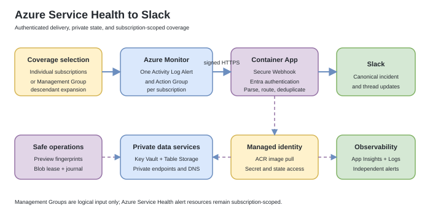

# Azure Service Health Slack Bot

Send authenticated Azure Service Health notifications to Slack and keep one
canonical incident message per subscription and tracking ID. Later Azure
updates edit the root message and add a broadcast reply to its Slack thread.

This is a community reference implementation. Azure Service Health remains the
source of truth; the bot does not acknowledge incidents, open support requests,
or replace an incident management platform.

## How it works

1. Azure Monitor matches `ServiceHealth` events in each covered subscription.
2. An Action Group sends Common Alert Schema through a Microsoft
   Entra-authenticated Secure Webhook.
3. Azure Container Apps authentication and the application validate the caller.
4. The application parses, routes, deduplicates, and stores incident state.
5. Slack receives a canonical root message and lifecycle updates in its thread.

Management Groups are a day-2 convenience: the tooling enumerates accessible
descendant subscriptions and creates a subscription-scoped alert path for each
one. Azure Service Health Activity Log Alerts are not scoped directly to a
Management Group.

## Start here

| Goal | Documentation |
|---|---|
| Understand the design | [Architecture and resources](docs/deployment-and-operations.md#architecture) |
| Deploy end to end | [Validated AZD deployment](docs/deployment-and-operations.md#deploy-with-azure-developer-cli) |
| Add or remove subscriptions | [Manage alert scopes](docs/deployment-and-operations.md#manage-alert-scopes) |
| Use a Management Group | [Management Group operations](docs/deployment-and-operations.md#manage-alert-scopes) |
| Operate or troubleshoot | [Operations runbook](docs/deployment-and-operations.md#operations) |
| Review security controls | [Security model](docs/deployment-and-operations.md#security-model) |
| Verify Microsoft claims | [Microsoft platform evidence](docs/microsoft-platform-evidence.md) |
| Browse all documentation | [Documentation index](docs/README.md) |

## Deployment at a glance

The supported deployment path uses Azure Developer CLI (`azd`) from a WSL
Linux filesystem. The complete runbook is deliberately fail-closed and is the
source of truth for required permissions, versions, previews, and acceptance
evidence.

1. Validate Azure CLI, AZD, Bicep, Docker, Python, quotas, and providers.
2. Select and pin the tenant, subscription, location, and AZD environment.
3. Create or authorize the Slack app and record its channel ID.
4. Install runtime, operational, and test dependencies.
5. Configure nonsecret inputs and an independent operations Action Group.
6. Reconcile the Secure Webhook identity and review the infrastructure preview.
7. Provision phase one and transfer the Slack token directly to Key Vault.
8. Build and deploy the Container App.
9. Verify health, authentication rejection, signed delivery, telemetry, and
   receipt in Slack.

Begin with
[Stage 0: verify the workstation](docs/deployment-and-operations.md#stage-0-verify-the-workstation).
Do not skip directly to `azd up`: the staged process prevents accidental
deployment to the wrong tenant or subscription and keeps the Slack token out of
shell history, AZD state, ARM parameters, and source control.

## What gets deployed

| Area | Main resources |
|---|---|
| Event delivery | Subscription Activity Log Alert and Secure Webhook Action Group |
| Compute | Azure Container Apps environment and Container App |
| Identity | Secure Webhook Entra application and user-assigned managed identity |
| Secrets and state | Key Vault, Azure Table Storage, and isolated operation-lock Storage |
| Networking | VNet integration, private endpoints, and private DNS |
| Images | Azure Container Registry with admin and anonymous access disabled |
| Observability | Application Insights, Log Analytics, availability test, and production alerts |

Key Vault and Table Storage have public network access disabled. Runtime access
uses managed identity. The webhook remains public HTTPS but requires Microsoft
Entra authentication plus application-level checks for the Azure Monitor caller,
token audience, and `ActionGroupsSecureWebhook` role.

## Scope management

The central deployment owns one immutable baseline subscription alert. Day-2
commands safely manage additional subscriptions or the descendants of a
non-overlapping Management Group.

- Every mutation requires a fresh fingerprint from a reviewed
  `--what-if --json` preview.
- Add operations create disabled alerts, send an official signed Action Group
  test, and enable delivery only after success.
- Remove operations revalidate ownership, membership, and references before
  deletion.
- Management Group migration enables replacement coverage before removing
  overlapping individual paths.
- The Tenant Root Group is rejected when it overlaps the central subscription.

See the
[complete add, test, migrate, and remove procedures](docs/deployment-and-operations.md#manage-alert-scopes).

## Incident behavior

- Routes can select Slack channels by subscription, Azure service, and region.
- Duplicate and out-of-order notifications are coordinated through Azure Table
  ETags and processing leases.
- Active incidents create or update a root Slack message.
- Updated and resolved notifications append broadcast thread replies.
- Permanent and transient failures emit distinct telemetry.
- Slack API rate limits and transient dependency failures are retried safely.

## Repository layout

| Path | Purpose |
|---|---|
| `service_health/` | Flask routes, authentication, parsing, routing, storage, and Slack rendering |
| `infra/` | Central and day-2 Bicep deployment graphs |
| `scripts/` | Secure Webhook, token lifecycle, locking, and scope operations |
| `config/` | Example routing configuration |
| `test/` | Runtime, infrastructure, CLI, and documentation contract tests |
| `docs/` | Full deployment runbook and official Microsoft evidence |
| `img/` | Architecture assets |

## Validation

The repository validates:

- supported Python versions on Linux, macOS, and Windows;
- payload parsing, authorization, routing, lifecycle, and Slack rendering;
- Table Storage concurrency and distributed operation locks;
- Secure Webhook and Slack token lifecycle failure states;
- subscription and Management Group day-2 contracts;
- central and day-2 Bicep build and lint;
- Docker image construction;
- documentation commands against implementation contracts.

Run the complete local validation commands from the
[Tests section](docs/deployment-and-operations.md#tests).

## Important limits

- Signed Action Group tests prove authenticated delivery but use synthetic
  subscription IDs; they do not prove subscription-specific routing.
- New scopes use the default Slack channel unless routing is updated first.
- Only one mutating deployment or operational hook should run per environment
  at a time.
- A Management Group is expanded from the subscriptions visible to the
  operator; inaccessible descendants fail coverage validation.
- Production requires an independent operations Action Group whose receiver
  does not depend solely on this bot.

Review all [known limits](docs/deployment-and-operations.md#known-limits) before
production use.

## Community and support

Read [CONTRIBUTING.md](CONTRIBUTING.md) before proposing a change. Use
[SUPPORT.md](SUPPORT.md) for support boundaries. Report suspected
vulnerabilities privately as described in [SECURITY.md](SECURITY.md).

## License

Licensed under the [MIT License](LICENSE).
